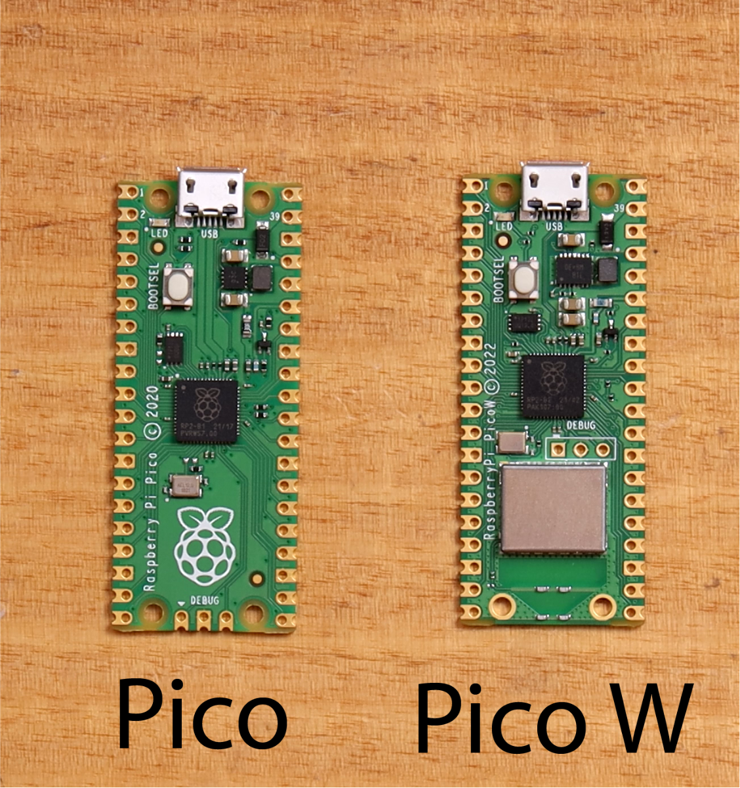
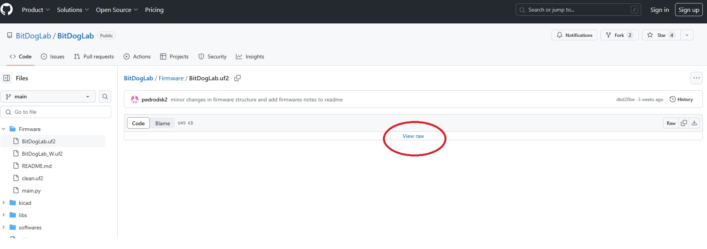
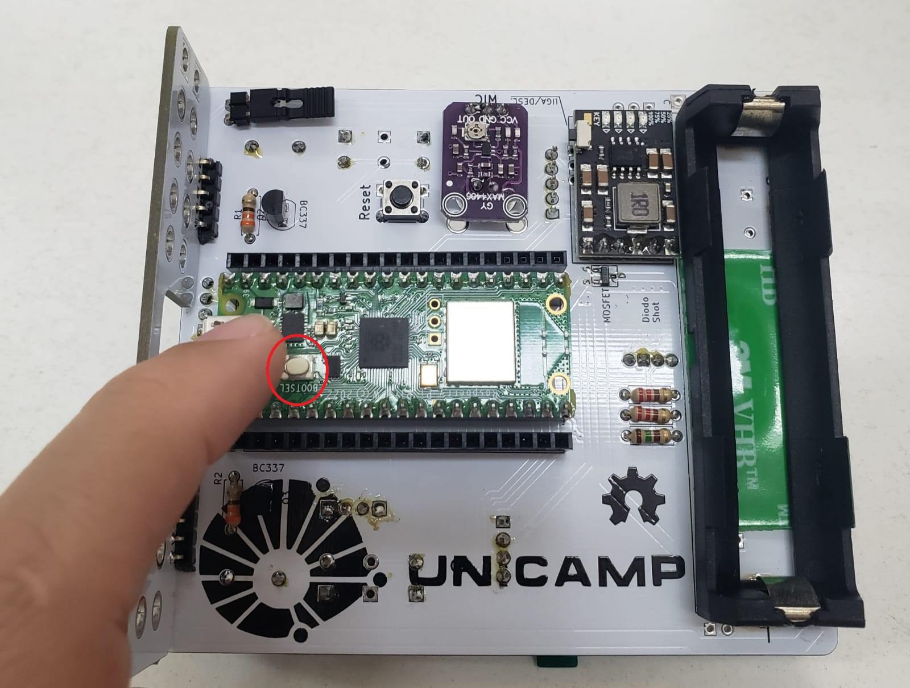
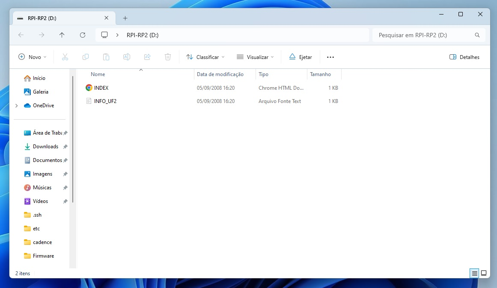
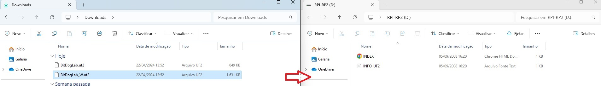

# Firmware Beta v0.1 da BitDogLab com Micropython 1.22.1
### O Firmware da BitDogLab foi compilado em 04/02/2024 e já inclui as seguintes libs 3rd:
* ahtx0 (Sensor de temperatura/umidade AHT10 i2c)
* bh1750 (Sensor de luminosidade i2c)
* ssd1306 (Oled i2c)

## [Download do Firmware](https://github.com/Fruett/BitDogLab/tree/main/Firmware)

# Passo a passo para instalar o firmware da BitDogLab

### 1. Baixe o firmware de acordo com a versão da sua Raspberry pi pico
* [BitDogLab.uf2 para a Raspberry Pico](https://github.com/BitDogLab/BitDogLab/blob/main/Firmware/BitDogLab.uf2)  
* [BitDogLab_W.uf2 para a Raspberry Pico W](https://github.com/BitDogLab/BitDogLab/blob/main/Firmware/BitDogLab_W.uf2)




### 2. Entre no modo bootloader segurando o botão bootsel da raspberry pi, ainda com o botão pressionado encaixe o cabo micro usb na raspberry pi pico e no computador.



### 3. Solte o botão e aguarde abrir uma nova janela do windows.



### 4. Copie o firmware baixado para a janela aberta no passo anterior



# Passo a passo para compilar o firmware da BitDogLab (opcional)
## Instalar as depedências na rpi4 
```
sudo apt update -y &
sudo apt install cmake build-essential libffi-dev git pkg-config gcc-arm-none-eabi -y
```
## Clonar os repositórios
```
cd ~/ &
git@github.com:Fruett/BitDogLab.git &
git clone https://github.com/micropython/micropython.git --branch master &
cd micropython &
make -C mpy-cross
```
### 1. Buid - Raspberry PI PICO
```
make -C ports/rp2 BOARD=RPI_PICO clean &
make -C ports/rp2 BOARD=RPI_PICO submodules &
make -C ports/rp2 BOARD=RPI_PICO FROZEN_MANIFEST=~/BitDogLab/libs/manifest.py
```
### 2. Build -Raspberry PI PICO W
```
make -C ports/rp2 BOARD=RPI_PICO_W clean
make -C ports/rp2 BOARD=RPI_PICO_W submodules
make -C ports/rp2 BOARD=RPI_PICO_W -j 16 FROZEN_MANIFEST=~/BitDogLab/libs/manifest_pico_w.py
```
## Pastas dos Firmwares
* ports/rp2/build-RPI_PICO/firmware.uf2
* ports/rp2/build-RPI_PICO_W/firmware.uf2

# Instalar as libs 3rd em um firmware já existente
```
sudo mpremote mip install github:Fruett/BitDogLab
```

