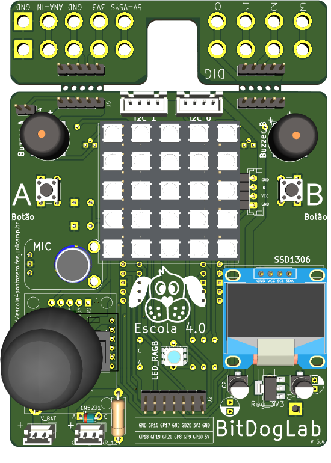
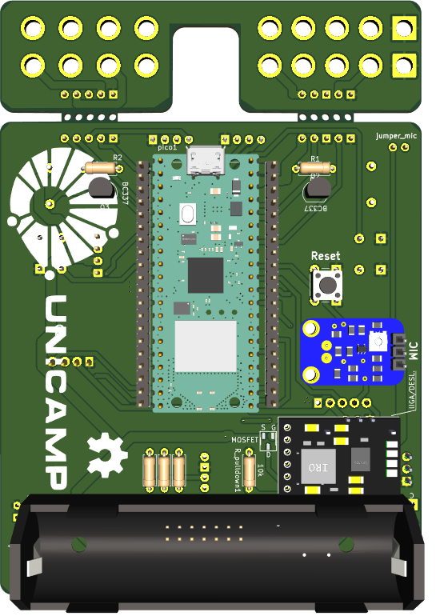

# BitDogLab

BitDogLab, an initiative of the School Project 4.0 at Unicamp, is an educational tool devoted to electronics and computing. Based on Raspberry Pi Pico H or W, it allows users to explore, assemble, and program using components mounted on its board and also external ones connected in an organized and secure manner. Meticulously selected, the components foster hands-on learning, encouraging users to enhance programming and electronics skills synergistically and progressively. This enriching platform offers a vibrant experience, immersing users in a colourful, auditory, and synesthetic learning environment. Additionally, BitDogLab is optimized for programming assisted by large language models (LLM), like GPT-4, facilitating a more intuitive learning guided by a tireless tutor. Aimed at pre-university education, BitDogLab aims to catalyze the incorporation of educational technology, providing a robust and flexible tool uniquely integrated into students' learning journey.

A hallmark of BitDogLab is that its project is entirely open, allowing it to be freely copied, manufactured, assembled, and improved by users. More information at: https://github.com/Fruett/BitDogLab

This repository holds open-source design files for BitDogLab, an educational STEAM tool. It includes various components like LEDs, buzzers, buttons, and more, promoting collaborative modification and enhancement of STEAM education.

## Version 5.4 (DIY)

### Release notes v5.4
* Changing GPIO4 to GPIO10 in Buzzer B
* Changing pin4 GPIO10 by GPIO8 in IDC connector
* Changing pin8 with GPIO8 by GPIO4 in IDC connector 
* Adding 10k pulldown resistor in batt charging mosfet
### Gerber files for fabrication:
* ADD

### Bill Of material (BOM) for PCB external modules version
* https://docs.google.com/spreadsheets/d/10G9U2lKZ8DwIemRyy8-OiIrZH5e2oOeCSGOkK32-5-8/edit?usp=sharing

## Version 5.3 (PCB SMD version)

SMD PCB version top Side view

SMD PCB version bottom Side view

KiCAD PCB layout: 
* [Panel PCB](https://github.com/Fruett/BitDogLab/blob/main/kicad/bitdoglabsmd/bitdoglab_painel/bitdoglab_painel.kicad_pcb)
* [SMD PCB with Raspberry Pi Pico W](https://github.com/Fruett/BitDogLab/blob/main/kicad/bitdoglabsmd/bitdoglab_main/bitdoglab_smd.kicad_pcb)

Gerber files for fabrication (2024-03-13): 
* [v5.3 panel fabrication files](https://github.com/Fruett/BitDogLab/blob/main/kicad/bitdoglabsmd/bitdoglab_painel/bitdoglab_painel-fabrication-files.zip)
* [v5.3 main fabrication files](https://github.com/Fruett/BitDogLab/blob/main/kicad/bitdoglabsmd/bitdoglab_main/bitdoglab_smd-fabrication-files.zip)

Bill Of material -BOM (2024-03-13): 
* [BOM v5.3 spreadsheet](https://docs.google.com/spreadsheets/d/10G9U2lKZ8DwIemRyy8-OiIrZH5e2oOeCSGOkK32-5-8/edit#gid=1766402277)
* [BOM v5.3 CSV](https://github.com/Fruett/BitDogLab/blob/main/kicad/bitdoglabsmd/bitdoglab_main/bitdoglab_smd.csv)

## Hardware Data Base or Banco de Informação de Hardware
English: https://docs.google.com/document/d/1bf_AKWDJkhcB7H8UVbGR0fSsl2v-2yXr_iV1fd5NWmE/edit?usp=sharing

Português: https://docs.google.com/document/d/13-68OqiU7ISE8U2KPRUXT2ISeBl3WPhXjGDFH52eWlU/edit?usp=sharing

#### Sponsor: IEEE-EDS: https://eds.ieee.org/chapters/programs-and-stem-outreach-resources
#### Sponsor: CNPq - INCT - Namitec: https://web.facebook.com/INCTNAMITEC/?_rdc=1&_rdr
#### Supporter: [Hardware Innovation Technologies (Paulinia/SP/Brazil)](http://www.hwit.com.br/)
