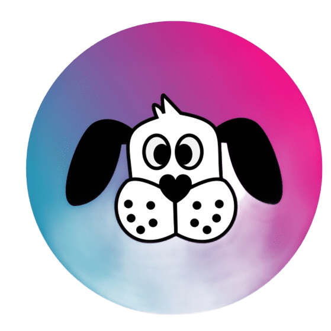
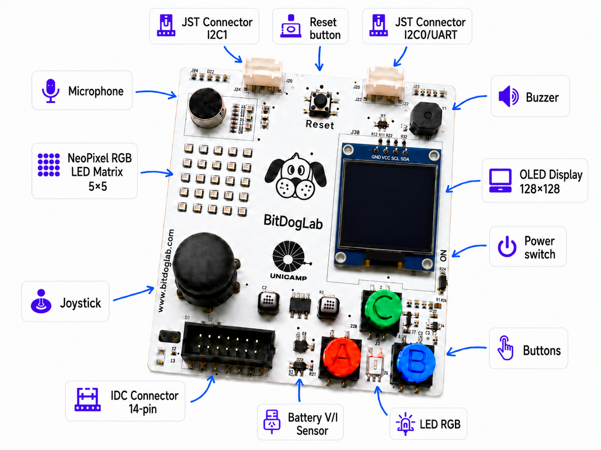
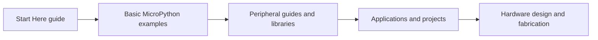

  

<h1 align="center">BitDogLab V7</h1>

  Open-source educational hardware for embedded systems, programming, electronics, and physical computing.

  <a href="README.md">English</a> |
  <a href="README.pt-BR.md">Português</a>

BitDogLab is an initiative of the **Escola 4.0 project at FEEC/Unicamp**. It brings together the Raspberry Pi Pico ecosystem and the main peripherals used in embedded systems, providing a practical platform for education, experimentation, and project development.

The current board is **BitDogLab Version 7**, with support for Raspberry Pi Pico-compatible modules based on the **RP2040** and **RP2350** microcontrollers.

Its hands-on approach supports the development of scientific thinking, problem solving, collaboration, and digital culture, competencies emphasized by Brazil's National Common Curricular Base (BNCC).

## Board and Peripherals

  

The board provides direct access to the main resources used in embedded-system education, including buttons, joystick, RGB LED, LED matrix, OLED display, microphone, buzzer, sensors, and expansion connectors.

## Recommended Learning Path

  

```mermaid
flowchart LR
    A[Start Here guide] --> B[Basic MicroPython examples]
    B --> C[Peripheral guides and libraries]
    C --> D[Applications and projects]
    D --> E[Hardware design and fabrication]
```

1. Follow the [Start Here guide](COMECE_POR_AQUI_BitDogLab_V7_MicroPython.md) to prepare the board and run the first test.
2. Study the [`basic-examples/`](basic-examples/) directory, organized from simpler to more advanced peripherals.
3. Use the [V7 peripheral guides](doc/Bitdoglab%20V7/) and reusable [`libs_software/`](libs_software/) modules.
4. Explore and develop applications in [`projects/`](projects/).
5. Study or manufacture the board using the public files in [`pcb-prototyping/`](pcb-prototyping/).

## Start Programming

The fastest text-based path is MicroPython with Thonny:

- [Illustrated MicroPython start guide](COMECE_POR_AQUI_BitDogLab_V7_MicroPython.md)
- [60 basic peripheral examples](basic-examples/README.md)
- [Complete peripheral test](testar_perifericos_gerais.py)
- [MicroPython firmware](firmware/)
- [Reusable software libraries](libs_software/README.md)

## Active Programming Projects

### Blockly for BitDogLab

Blockly is the easiest way to get started with BitDogLab. It is designed for students and beginners learning programming logic and embedded systems. The tool runs directly in the browser without requiring installation.

To use it:

[Open Blockly for BitDogLab](https://bitdoglab-blocos.github.io/BIPES-BITDOGLAB/ui/)

1. Connect the BitDogLab to the computer using a USB cable.
2. Open Blockly for BitDogLab, preferably in Chrome or Edge.
3. Select the serial port corresponding to the board.
4. Drag and connect blocks to create the program.
5. Click `Run` or `Upload` to send the program to the BitDogLab.

> **Important:** If the board already contains a file named `main.py`, remove it before using Blockly. This file can prevent the tool from communicating correctly with the microcontroller.

### BIH - Hardware Information Database

  

The **BIH** is a hardware information database designed to adapt the BitDogLab technical context for Large Language Models (LLMs), including ChatGPT, Gemini, and other AI assistants.

It describes the board's pin assignments, peripherals, interfaces, and hardware constraints. By providing the BIH to an LLM before requesting a program, the model can generate MicroPython or C/C++ code that better matches the BitDogLab hardware.

- [Open the BitDogLab V7 BIH](https://docs.google.com/document/d/13-68OqiU7ISE8U2KPRUXT2ISeBl3WPhXjGDFH52eWlU/edit?usp=sharing)
- [Open the visual hardware database](https://docs.google.com/document/d/1-2Eoo6H1gfTAlxZgFs26p7X4CeaLkS8X8hNTC96PetQ/edit?usp=sharing)

### FluxCode

**UNDER CONSTRUCTION**

### Pixel Art Application

**UNDER CONSTRUCTION**

## BitDogLab V7 Hardware

BitDogLab V7 integrates an RGB LED, a 5x5 WS2812B matrix, three buttons, analog joystick, buzzer, analog microphone, OLED display, power monitoring, and expansion connections around a Raspberry Pi Pico-compatible module.

The V7 hardware was developed in **Altium Designer**. Source files, schematic, PCB layout, BOM, pick-and-place data, STEP model, and public Gerber files for fabrication are available in [`pcb-prototyping/BitDogLab V7/`](pcb-prototyping/BitDogLab%20V7/).

  
  

BitDogLab V6 was developed in **KiCad** and remains available for study and fabrication. See the complete [PCB and fabrication documentation](pcb-prototyping/README.md).

## Repository Structure

| Path | Content |
|---|---|
| [`basic-examples/`](basic-examples/) | Beginner-friendly MicroPython examples organized by peripheral. |
| [`doc/`](doc/) | BitDogLab V6 and V7 documentation and peripheral guides. |
| [`firmware/`](firmware/) | MicroPython firmware and installation resources. |
| [`libs_software/`](libs_software/) | Reusable MicroPython drivers and helper modules. |
| [`pcb-prototyping/`](pcb-prototyping/) | PCB source files and public manufacturing files. |
| [`projects/`](projects/) | Applications, sensors, IoT, tools, and hardware expansions. |

## Open Hardware and License

BitDogLab is open hardware. Its design and fabrication files are publicly available for study, modification, and manufacturing.

The project is licensed under the **CERN Open Hardware Licence Version 2 - Strongly Reciprocal (CERN-OHL-S v2.0)**. See [`LICENSE`](LICENSE).

## Initiative and Contributors

- Initiative: **Escola 4.0 - FEEC/Unicamp**
- Project coordination: **Prof. Dr. Fabiano Fruett**
- Contributors: students and collaborators from Escola 4.0 and FEEC/Unicamp
- Support: IEEE-EDS STEM outreach program and CNPq - INCT Namitec
