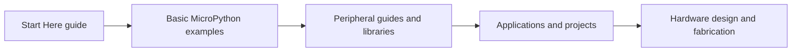

<p align="center">
  
</p>

<h1 align="center">BitDogLab V7</h1>

<p align="center">
  Open-source educational hardware for embedded systems, programming, electronics, and physical computing.
</p>

<p align="center">
  <a href="README.md">English</a> |
  <a href="README.pt-BR.md">Português</a>
</p>

BitDogLab is an initiative of the **Escola 4.0 project at FEEC/Unicamp**. It brings together the Raspberry Pi Pico ecosystem and the main peripherals used in embedded systems, providing a practical platform for education, experimentation, and project development.

The current board is **BitDogLab Version 7**, with support for Raspberry Pi Pico-compatible modules based on the **RP2040** and **RP2350** microcontrollers.

Its hands-on approach supports the development of scientific thinking, problem solving, collaboration, and digital culture, competencies emphasized by Brazil's National Common Curricular Base (BNCC).

## Board and Peripherals

<p align="center">
  
</p>

The board provides direct access to the main resources used in embedded-system education, including buttons, joystick, RGB LED, LED matrix, OLED display, microphone, buzzer, sensors, and expansion connectors.

## Recommended Learning Path

<p align="center">
  
</p>


```mermaid
flowchart LR
    A[Start Here guide] --> B[Basic MicroPython examples]
    B --> C[Peripheral guides and libraries]
    C --> D[Applications and projects]
    D --> E[Hardware design and fabrication]
```

1. Follow the [Start Here guide](COMECE_POR_AQUI_BitDogLab_V7_MicroPython.md) to prepare the board and run the first test.
2. Study the [`basic-examples/`](basic-examples/) directory, organized from simpler to more advanced peripherals.
3. Use the [V7 peripheral guides](doc/Bitdoglab%20V7/) and reusable [`libs_software/`](libs_software/) modules.
4. Explore and develop applications in [`projects/`](projects/).
5. Study or manufacture the board using the public files in [`pcb-prototyping/`](pcb-prototyping/).

## Start Programming

The fastest text-based path is MicroPython with Thonny:

- [Illustrated MicroPython start guide](COMECE_POR_AQUI_BitDogLab_V7_MicroPython.md)
- [60 basic peripheral examples](basic-examples/README.md)
- [Complete peripheral test](testar_perifericos_gerais.py)
- [MicroPython firmware](firmware/)
- [Reusable software libraries](libs_software/README.md)

## Active Programming Projects

### Blockly for BitDogLab


Blockly is the easiest way to get started with BitDogLab. It is designed for students and beginners learning programming logic and embedded systems. The tool runs directly in the browser without requiring installation.

To use it:

[Open Blockly for BitDogLab](https://bitdoglab-blocos.github.io/BIPES-BITDOGLAB/ui/)

1. Connect the BitDogLab to the computer using a USB cable.
2. Open Blockly for BitDogLab, preferably in Chrome or Edge.
3. Select the serial port corresponding to the board.
4. Drag and connect blocks to create the program.
5. Click `Run` or `Upload` to send the program to the BitDogLab.

> **Important:** If the board already contains a file named `main.py`, remove it before using Blockly. This file can prevent the tool from communicating correctly with the microcontroller.

### BIH - Hardware Information Database

<p align="center">
  <a href="https://docs.google.com/document/d/13-68OqiU7ISE8U2KPRUXT2ISeBl3WPhXjGDFH52eWlU/edit?usp=sharing">
    
  </a>
</p>

The **BIH** is a hardware information database designed to adapt the BitDogLab technical context for Large Language Models (LLMs), including ChatGPT, Gemini, and other AI assistants.

It describes the board's pin assignments, peripherals, interfaces, and hardware constraints. By providing the BIH to an LLM before requesting a program, the model can generate MicroPython or C/C++ code that better matches the BitDogLab hardware.

- [Open the BitDogLab V7 BIH](https://docs.google.com/document/d/13-68OqiU7ISE8U2KPRUXT2ISeBl3WPhXjGDFH52eWlU/edit?usp=sharing)
- [Open the visual hardware database](https://docs.google.com/document/d/1-2Eoo6H1gfTAlxZgFs26p7X4CeaLkS8X8hNTC96PetQ/edit?usp=sharing)

### FluxCode

O BitDogLab FluxCode é um aplicativo Android desenvolvido para auxiliar estudantes e professores na criação de códigos em **MicroPython** para a placa **BitDogLab**, utilizando **Inteligência Artificial multimodal** para interpretar fluxogramas desenhados manualmente.

O usuário desenha a lógica do programa em papel, fotografa o fluxograma pelo aplicativo e recebe automaticamente um código em MicroPython, que pode ser executado ou salvo diretamente na placa BitDogLab.

O **BitDogLab FluxCode** foi criado para apoiar o ensino de programação, especialmente para usuários iniciantes que ainda possuem dificuldade na transição entre a lógica de programação, a representação por fluxogramas e a escrita de código textual.

A proposta utiliza uma abordagem **desplugada**, na qual o estudante desenvolve inicialmente o raciocínio lógico em papel, utilizando símbolos de fluxograma. Em seguida, o aplicativo interpreta a imagem com apoio de uma LLM multimodal e gera o código correspondente em MicroPython.

Essa abordagem permite que o estudante concentre seus esforços em elementos fundamentais do **pensamento computacional**, como:

- construção da lógica;
- decomposição do problema;
- representação de algoritmos;
- relação entre fluxograma e código;
- experimentação prática com computação física.

## Principais funcionalidades

- Captura de fluxogramas desenhados manualmente.
- Interpretação do fluxograma com Inteligência Artificial multimodal.
- Geração automática de código em MicroPython.
- Visualização do pseudocódigo gerado.
- Execução do código diretamente na placa BitDogLab.
- Salvamento de arquivos na placa.
- Editor de código integrado.
- Acesso aos projetos salvos no smartphone.
- Acesso aos códigos armazenados na placa por meio da função **Mochila**.
- Terminal integrado para acompanhar a execução dos comandos.
- Funções para executar, reiniciar, encerrar e limpar o terminal.

---

## Requisitos

Para utilizar o aplicativo, são necessários:

- Smartphone ou tablet Android;
- Placa BitDogLab com MicroPython instalado;
- Cabo USB Tipo C para Micro USB compatível com transferência de dados;
- Conexão com a internet;
- Folha sulfite;
- Caneta azul ou preta;
- Gabarito de fluxograma impresso em 3D.

### Cabo USB recomendado

| Especificação | Descrição |
|---|---|
| Marca | Vention |
| Modelo | USB |
| Conector de entrada | USB Tipo C |
| Conector de saída | Micro USB |
| Tipo de cabo | USB 2.0 |
| Modelo alfanumérico | COVBD |
| Cor | Preto |

> Observação: é importante utilizar um cabo USB que permita transferência de dados, e não apenas carregamento.

---

## Instalação do aplicativo

Atualmente, o aplicativo está disponível apenas para dispositivos **Android**.

1. Baixe o aplicativo pelo link disponibilizado no manual ou no repositório do projeto.
2. Autorize a instalação de aplicativos de fontes externas, caso o Android solicite essa permissão.
3. Instale o aplicativo no smartphone ou tablet.
4. Abra o aplicativo para acessar a tela inicial.

---

## Como utilizar

### 1. Conectar a placa BitDogLab

Conecte a placa BitDogLab ao dispositivo Android utilizando um cabo USB compatível.

Ao conectar a placa, o Android poderá solicitar permissão para permitir o acesso ao dispositivo USB. Nesse caso, toque em **Permitir**.

Caso a mensagem de permissão não apareça automaticamente, toque no botão **Conectar** dentro do aplicativo.

Quando a conexão for estabelecida, o aplicativo exibirá novas opções na interface, como:

- **Console**: permite visualizar comandos e mensagens da execução;
- **Mochila**: permite acessar os códigos salvos na placa BitDogLab.

---

### 2. Desenhar o fluxograma

Em uma folha sulfite, desenhe o fluxograma da lógica desejada utilizando:

- caneta azul ou preta;
- gabarito de símbolos de fluxograma;
- boa organização visual;
- setas indicando corretamente o fluxo do algoritmo.

O gabarito de fluxograma pode ser impresso em 3D a partir do arquivo STL disponibilizado no projeto.

---

### 3. Capturar o fluxograma pelo aplicativo

No aplicativo, toque na opção **Foto Código**.

A câmera do dispositivo será aberta. Posicione a folha dentro da área de captura indicada na tela e toque no ícone de câmera.

Após a captura, a imagem será enviada para interpretação pela Inteligência Artificial. Esse processo pode levar alguns segundos ou até cerca de 1 minuto, dependendo da qualidade da conexão com a internet.

---

### 4. Gerar e visualizar o código

Após a interpretação do fluxograma, o aplicativo exibirá o código em **MicroPython** gerado automaticamente.

Nessa tela, o usuário poderá:

- visualizar o código gerado;
- visualizar o pseudocódigo;
- executar o código na placa;
- salvar o código diretamente na placa BitDogLab.

Para que o programa seja executado automaticamente sempre que a placa for ligada, salve o arquivo com o nome:

```text
main.py
```

---

### 5. Executar o código na placa

Para executar o programa, toque no botão **Executar**.

O aplicativo abrirá a tela de terminal. Quando o código for executado corretamente, a mensagem abaixo será exibida:

```text
ok
```

Caso a mensagem não apareça, verifique a conexão USB com a placa, desconecte e conecte novamente o cabo e tente executar o código mais uma vez.

---

### 6. Encerrar ou limpar a execução

Na tela de terminal, o usuário pode utilizar os seguintes botões:

- **Executar**: executa o código na placa;
- **Reiniciar**: reinicia a execução;
- **Encerrar**: interrompe o código em execução;
- **Limpar**: limpa as mensagens exibidas no terminal.

---

## Função Mochila

A função **Mochila** permite acessar os arquivos salvos diretamente na placa BitDogLab.

Ao abrir a Mochila, o usuário pode visualizar os códigos armazenados na placa. Ao selecionar um arquivo, o aplicativo apresenta as seguintes opções:

- **Executar**: executa o código selecionado;
- **Abrir no editor**: abre o código para visualização ou edição;
- **Renomear**: altera o nome do arquivo;
- **Excluir**: remove o arquivo da placa.

---

## Editor de código

O aplicativo também possui um editor integrado, que permite escrever, visualizar e modificar códigos em MicroPython diretamente no dispositivo Android.

Após editar o código, o usuário pode executá-lo na placa BitDogLab e acompanhar a execução pelo terminal do aplicativo.

---

## Problemas comuns

### O aplicativo não reconhece a placa

Verifique se o cabo USB é compatível com transferência de dados. Em seguida, desconecte e conecte novamente a placa e toque no botão **Conectar**.

### O código não executa

Verifique se a mensagem `ok` aparece no terminal. Caso não apareça, refaça a conexão com a placa e execute o código novamente.

### O código gerado apresentou erro

Capture novamente a foto do fluxograma, garantindo:

- boa iluminação;
- folha bem enquadrada;
- desenho legível;
- setas bem posicionadas;
- uso de caneta azul ou preta.

---

## Boas práticas para captura do fluxograma

Para melhorar a interpretação pela Inteligência Artificial:

- desenhe em local bem iluminado;
- evite sombras sobre a folha;
- mantenha a câmera alinhada com o papel;
- use traços fortes e legíveis;
- evite rasuras;
- posicione toda a folha dentro da área de captura;
- utilize corretamente os símbolos do gabarito.

---

## Tecnologias envolvidas

- Android;
- MicroPython;
- BitDogLab;
- Inteligência Artificial multimodal;
- LLM para interpretação de imagem e geração de código;
- Comunicação USB entre smartphone/tablet e placa.

---

## Aplicações educacionais

O BitDogLab IA App pode ser utilizado em atividades de:

- introdução à programação;
- pensamento computacional;
- lógica de programação;
- robótica educacional;
- computação física;
- oficinas STEAM;
- ensino com metodologias desplugadas;
- transição entre fluxogramas e programação textual.

---
### Pixel Art Application

**UNDER CONSTRUCTION**

## BitDogLab V7 Hardware

BitDogLab V7 integrates an RGB LED, a 5x5 WS2812B matrix, three buttons, analog joystick, buzzer, analog microphone, OLED display, power monitoring, and expansion connections around a Raspberry Pi Pico-compatible module.

The V7 hardware was developed in **Altium Designer**. Source files, schematic, PCB layout, BOM, pick-and-place data, STEP model, and public Gerber files for fabrication are available in [`pcb-prototyping/BitDogLab V7/`](pcb-prototyping/BitDogLab%20V7/).

<p align="center">
  
  
</p>

BitDogLab V6 was developed in **KiCad** and remains available for study and fabrication. See the complete [PCB and fabrication documentation](pcb-prototyping/README.md).

## Repository Structure

| Path | Content |
|---|---|
| [`basic-examples/`](basic-examples/) | Beginner-friendly MicroPython examples organized by peripheral. |
| [`doc/`](doc/) | BitDogLab V6 and V7 documentation and peripheral guides. |
| [`firmware/`](firmware/) | MicroPython firmware and installation resources. |
| [`libs_software/`](libs_software/) | Reusable MicroPython drivers and helper modules. |
| [`pcb-prototyping/`](pcb-prototyping/) | PCB source files and public manufacturing files. |
| [`projects/`](projects/) | Applications, sensors, IoT, tools, and hardware expansions. |

## Open Hardware and License

BitDogLab is open hardware. Its design and fabrication files are publicly available for study, modification, and manufacturing.

The project is licensed under the **CERN Open Hardware Licence Version 2 - Strongly Reciprocal (CERN-OHL-S v2.0)**. See [`LICENSE`](LICENSE).

## Initiative and Contributors

- Initiative: **Escola 4.0 - FEEC/Unicamp**
- Project coordination: **Prof. Dr. Fabiano Fruett**
- Contributors: students and collaborators from Escola 4.0 and FEEC/Unicamp
- Support: IEEE-EDS STEM outreach program and CNPq - INCT Namitec
