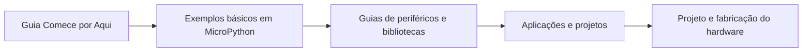
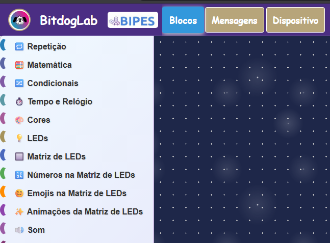

  

<h1 align="center">BitDogLab V7</h1>

  Hardware educacional aberto para sistemas embarcados, programação, eletrônica e computação física.

  <a href="README.md">English</a> |
  <a href="README.pt-BR.md">Português</a>

A BitDogLab é uma iniciativa do projeto **Escola 4.0 da FEEC/Unicamp**. Ela reúne o ecossistema Raspberry Pi Pico e os principais periféricos utilizados em sistemas embarcados, oferecendo uma plataforma prática para educação, experimentação e desenvolvimento de projetos.

A placa atual é a **BitDogLab Versão 7**, com suporte a módulos compatíveis com Raspberry Pi Pico baseados nos microcontroladores **RP2040** e **RP2350**.

Sua abordagem mão na massa contribui para o desenvolvimento do pensamento científico, resolução de problemas, colaboração e cultura digital, competências valorizadas pela Base Nacional Comum Curricular (BNCC).

## Placa e Periféricos

  

A placa oferece acesso direto aos principais recursos utilizados no ensino de sistemas embarcados, incluindo botões, joystick, LED RGB, matriz de LEDs, display OLED, microfone, buzzer, sensores e conectores de expansão.

## Fluxo Recomendado de Aprendizagem

1. Siga o guia [Comece por Aqui](COMECE_POR_AQUI_BitDogLab_V7_MicroPython.md) para preparar a placa e executar o primeiro teste.
2. Estude a pasta [`basic-examples/`](basic-examples/), organizada dos periféricos mais simples aos mais avançados.
3. Utilize os [guias dos periféricos V7](doc/Bitdoglab%20V7/) e os módulos reutilizáveis de [`libs_software/`](libs_software/).
4. Explore e desenvolva aplicações em [`projects/`](projects/).
5. Estude ou fabrique a placa utilizando os arquivos públicos em [`pcb-prototyping/`](pcb-prototyping/).

## Comece a Programar

O caminho mais rápido para programação por texto é utilizar MicroPython com a Thonny:

- [Guia ilustrado para começar com MicroPython](COMECE_POR_AQUI_BitDogLab_V7_MicroPython.md)
- [60 exemplos básicos dos periféricos](basic-examples/README.md)
- [Teste completo dos periféricos](testar_perifericos_gerais.py)
- [Firmware MicroPython](firmware/)
- [Bibliotecas de software reutilizáveis](libs_software/README.md)

## Projetos Ativos de Programação

### Blockly para BitDogLab

  

O Blockly é a maneira mais simples de começar a programar a BitDogLab. Ele é indicado para estudantes e iniciantes que estão aprendendo lógica de programação e sistemas embarcados. A ferramenta funciona diretamente no navegador, sem necessidade de instalação.

[Abrir o Blockly para BitDogLab](https://bitdoglab-blocos.github.io/BIPES-BITDOGLAB/ui/)

Como utilizar:

1. Conecte a BitDogLab ao computador utilizando um cabo USB.
2. Abra o Blockly para BitDogLab, preferencialmente no Chrome ou Edge.
3. Selecione a porta serial correspondente à placa.
4. Arraste e conecte os blocos para criar o programa.
5. Clique em `Run` ou `Upload` para enviar o programa para a BitDogLab.

> **Importante:** caso a placa já contenha um arquivo chamado `main.py`, remova-o antes de utilizar o Blockly. Esse arquivo pode impedir a comunicação correta da ferramenta com o microcontrolador.

### BIH - Banco de Informações de Hardware

  

O **BIH** é um banco de informações de hardware criado para adaptar o contexto técnico da BitDogLab para Large Language Models (LLMs), incluindo ChatGPT, Gemini e outros assistentes de inteligência artificial.

Ele descreve a pinagem, os periféricos, as interfaces e as restrições do hardware. Ao fornecer o BIH para uma LLM antes de solicitar um programa, o modelo pode gerar códigos em MicroPython ou C/C++ mais adequados ao hardware da BitDogLab.

- [Abrir o BIH da BitDogLab V7](https://docs.google.com/document/d/13-68OqiU7ISE8U2KPRUXT2ISeBl3WPhXjGDFH52eWlU/edit?usp=sharing)
- [Abrir o banco visual de hardware](https://docs.google.com/document/d/1-2Eoo6H1gfTAlxZgFs26p7X4CeaLkS8X8hNTC96PetQ/edit?usp=sharing)

### FluxCode

**EM CONSTRUÇÃO**

### Aplicativo Pixel Art

**EM CONSTRUÇÃO**

## Hardware da BitDogLab V7

A BitDogLab V7 integra LED RGB, matriz WS2812B 5x5, três botões, joystick analógico, buzzer, microfone analógico, display OLED, monitoramento de alimentação e conexões de expansão ao redor de um módulo compatível com Raspberry Pi Pico.

O hardware da V7 foi desenvolvido no **Altium Designer**. Arquivos fonte, esquemático, layout da PCB, BOM, dados de pick-and-place, modelo STEP e arquivos Gerber públicos para fabricação estão disponíveis em [`pcb-prototyping/BitDogLab V7/`](pcb-prototyping/BitDogLab%20V7/).

  
  

A BitDogLab V6 foi desenvolvida no **KiCad** e continua disponível para estudo e fabricação. Consulte a [documentação completa da PCB e fabricação](pcb-prototyping/README.md).

## Estrutura do Repositório

| Caminho | Conteúdo |
|---|---|
| [`basic-examples/`](basic-examples/) | Exemplos MicroPython para iniciantes organizados por periférico. |
| [`doc/`](doc/) | Documentação e guias dos periféricos das versões V6 e V7. |
| [`firmware/`](firmware/) | Firmware MicroPython e materiais de instalação. |
| [`libs_software/`](libs_software/) | Drivers e módulos auxiliares reutilizáveis em MicroPython. |
| [`pcb-prototyping/`](pcb-prototyping/) | Arquivos fonte da PCB e arquivos públicos de fabricação. |
| [`projects/`](projects/) | Aplicações, sensores, IoT, ferramentas e expansões de hardware. |

## Hardware Aberto e Licença

A BitDogLab é um hardware aberto. Seus arquivos de projeto e fabricação estão disponíveis publicamente para estudo, modificação e fabricação.

O projeto utiliza a **CERN Open Hardware Licence Version 2 - Strongly Reciprocal (CERN-OHL-S v2.0)**. Consulte o arquivo [`LICENSE`](LICENSE).

## Iniciativa e Colaboradores

- Iniciativa: **Escola 4.0 - FEEC/Unicamp**
- Coordenação do projeto: **Prof. Dr. Fabiano Fruett**
- Colaboradores: estudantes e participantes da Escola 4.0 e FEEC/Unicamp
- Apoio: programa de divulgação STEM IEEE-EDS e CNPq - INCT Namitec
