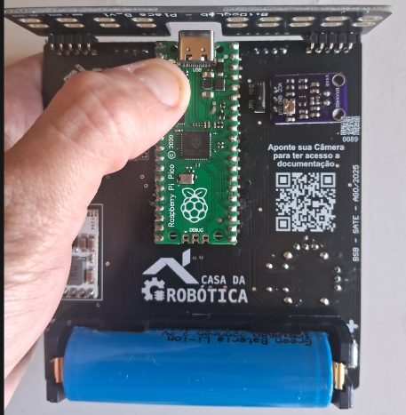
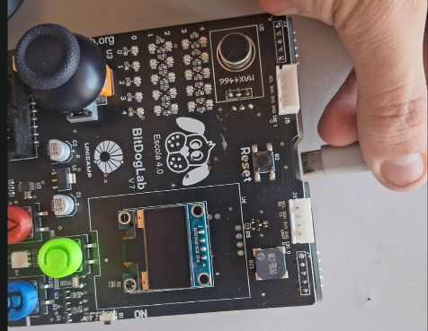
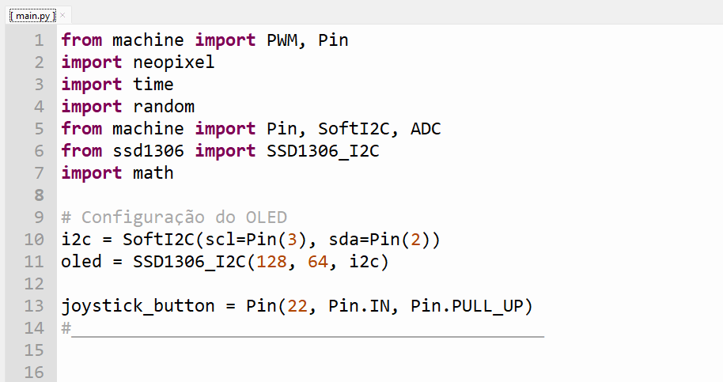
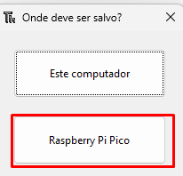
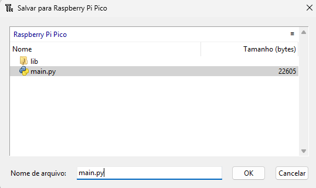
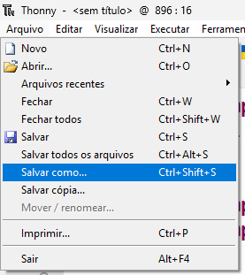
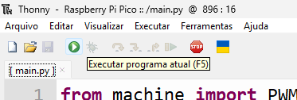

# [PT-BR] Start Here BitDogLab v7: Iniciando com MicroPython

**Table of Contents**

- [[PT-BR] Start Here BitDogLab v7: Iniciando com MicroPython](#pt-br-start-here-bitdoglab-v7-iniciando-com-micropython)
  - [Objetivo](#objetivo)
  - [Antes de começar](#antes-de-começar)
  - [Instalando a Thonny IDE](#instalando-a-thonny-ide)
  - [Configurando o interpretador MicroPython](#configurando-o-interpretador-micropython)
  - [Gravação do firmware](#gravação-do-firmware)
  - [Alternativas de gravação de firmware](#alternativas-de-gravação-de-firmware)
  - [Executando o primeiro teste da placa](#executando-o-primeiro-teste-da-placa)
  - [Salvando o código como main.py](#salvando-o-código-como-mainpy)
  - [O que observar durante o teste](#o-que-observar-durante-o-teste)

## Objetivo

Este guia apresenta o fluxo inicial para começar a usar a **BitDogLab v7** com **MicroPython** e a **Thonny IDE**.

Ao final deste procedimento, a placa estará pronta para receber códigos Python. O primeiro teste recomendado é copiar o código de verificação geral dos periféricos, colar na Thonny IDE e salvar na placa com o nome `main.py`.

Neste repositório, o código de teste está em:

```text
bitdoglab_v7_peripheral_self_test.py
```

Esse arquivo funciona como o teste geral de periféricos da BitDogLab v7. Ele pode ser renomeado futuramente para `testar_perifericos_gerais.py`, caso esse seja o padrão adotado para os exemplos básicos.

## Antes de começar

Você vai precisar de:

- uma placa BitDogLab v7;
- um cabo USB compatível com a Raspberry Pi Pico/Pico W/Pico 2 usada na placa;
- um computador com Windows, Linux ou macOS;
- a Thonny IDE instalada;
- o arquivo de teste geral dos periféricos.

Antes de instalar o firmware, localize o botão `BOOTSEL` da Raspberry Pi Pico/Pico W/Pico 2 instalada na BitDogLab.


O botão `BOOTSEL` é usado para colocar a placa em modo de gravação de firmware. Para executar programas normalmente, conecte a placa sem pressionar esse botão.

## Instalando a Thonny IDE

Para programar a BitDogLab com MicroPython, o primeiro passo é instalar a Thonny IDE. Ela é o ambiente onde escrevemos, salvamos e executamos o código na placa.

Acesse a página oficial:

https://thonny.org/

Em seguida, escolha a opção correta para o seu sistema operacional.

Windows:


Mac:


Linux:


Com o arquivo baixado, instale a Thonny IDE seguindo os passos do instalador. Assim que a instalação for concluída, abra a IDE.

## Configurando o interpretador MicroPython

A configuração principal da Thonny é a escolha do interpretador usado para executar os códigos.

Na Thonny IDE, acesse:

```text
Tools > Options
```


Na janela de configurações, acesse a aba `Interpreter` e selecione:

```text
MicroPython (Raspberry Pi Pico)
```


A porta serial da placa normalmente é detectada automaticamente pela Thonny. Se houver mais de uma placa conectada, selecione manualmente a porta correspondente à BitDogLab.

## Gravação do firmware

Com a Thonny configurada, é necessário gravar o firmware MicroPython na placa.

Para isso:

1. Desconecte a BitDogLab do computador.
2. Pressione e segure o botão `BOOTSEL`.
3. Mantendo o botão pressionado, conecte o cabo USB ao computador.
4. Depois que a placa for reconhecida, solte o botão.





Esse procedimento faz com que a placa entre em modo de gravação de firmware. O computador deve reconhecê-la como um disco removível chamado `RPI-RP2`.


Com a placa em modo bootloader, volte à aba `Interpreter` da Thonny. A janela deve mostrar a opção para instalar ou atualizar o firmware.


Clique em:

```text
Install or update firmware
```

Na janela seguinte, confira se o dispositivo selecionado é a Raspberry Pi Pico/Pico W/Pico 2 correta.


Em seguida, instale a versão desejada do MicroPython.


Aguarde até que a instalação termine. Ao final, feche a janela de instalação, desconecte a placa e conecte novamente sem pressionar `BOOTSEL`.

Agora a BitDogLab está pronta para receber códigos Python.

## Alternativas de gravação de firmware

Também é possível gravar o firmware manualmente por drag-and-drop.

Nesse método, a placa deve estar em modo bootloader e aparecer como disco `RPI-RP2`. Depois, basta copiar o arquivo `.uf2` do firmware para esse disco.

Firmware oficial MicroPython:

- Raspberry Pi Pico: https://micropython.org/download/RPI_PICO/
- Raspberry Pi Pico W: https://micropython.org/download/RPI_PICO_W/

## Executando o primeiro teste da placa

Com a configuração finalizada e o firmware MicroPython instalado, o próximo passo é executar o teste geral dos periféricos.

Abra o arquivo:

```text
bitdoglab_v7_peripheral_self_test.py
```

Copie todo o conteúdo do arquivo e cole na área principal da Thonny IDE.



Esse teste foi pensado para validar, em sequência, os principais recursos da BitDogLab v7, incluindo:

- LED RGB;
- matriz de LEDs RGB 5x5;
- botões A e B;
- botão do joystick;
- joystick analógico;
- buzzer;
- display OLED;
- microfone.

## Salvando o código como main.py

Para que a placa execute o teste automaticamente, salve o código na memória da Raspberry Pi Pico/Pico W/Pico 2 com o nome `main.py`.

Na Thonny, clique em:

```text
File > Save as...
```

Escolha salvar no dispositivo:

```text
Raspberry Pi Pico
```



Na janela de nome do arquivo, digite:

```text
main.py
```



Depois de salvar, confira se o arquivo aparece na lista de arquivos da placa.



O nome `main.py` é importante porque o MicroPython executa automaticamente esse arquivo quando a placa inicia.

## Executando o código

Com o arquivo salvo na placa, pressione o botão `Run` da Thonny para executar o código.



Se o arquivo foi salvo como `main.py`, a BitDogLab também executará esse teste automaticamente sempre que for ligada ou reiniciada.

## O que observar durante o teste

Durante a execução, observe se:

- a matriz de LEDs exibe animações;
- o LED RGB muda de cor;
- o display OLED mostra mensagens;
- o buzzer emite sons;
- os botões A e B respondem quando pressionados;
- o joystick altera o comportamento esperado;
- o botão do joystick responde;
- o microfone altera a visualização de intensidade sonora.

Se algo não funcionar, confira:

- se a placa correta está selecionada na Thonny;
- se o firmware MicroPython foi instalado corretamente;
- se a placa foi reconectada sem pressionar `BOOTSEL`;
- se o arquivo foi salvo exatamente como `main.py`;
- se as bibliotecas necessárias, como `ssd1306.py` e `neopixel.py`, estão disponíveis na placa.

As bibliotecas reutilizáveis do repositório estão organizadas em:

```text
libs_software/
```

Depois de validar a placa com esse teste geral, o próximo passo é estudar exemplos menores e isolados em:

```text
basic-examples/
```

Essa pasta deve conter exemplos curtos, didáticos e focados em um periférico por vez.
