# BitDogLab Pico Tela LCD 1.54 inch Colorida SPI

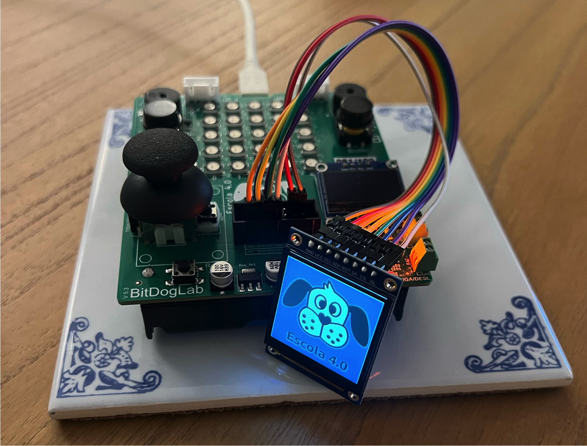

Adicione a sua BitDogLab uma tela de 220 ppi (240x240 pixels) com 16-bit de cores, ou seja 65536 entre RGB (Red/Vermelho, Blue/Azul e Green/Verde) como um display IPS (in plane switching LCD) usando protocolo SPI (serial peripheral interface). 

Devido ao display utilizado nesse artigo possuir comunicação SPI e ser de baixo custo, a empresa [Pimoroni](https://shop.pimoroni.com/products/1-54-spi-colour-square-lcd-240x240-breakout) adaptou um driver que pode ser utilizado para controlar esse display com uma raspberry pi, o driver foi originalmente criado por [Libdriver](https://github.com/libdriver/st7789) que controla o chip ST7786 da empresa [Sitronix](https://github.com/libdriver/st7789/blob/master/datasheet/st7789_datasheet.pdf), um chip capaz de controlar até 240x320 pixels com 18bit de cores (262k cores) com memoria em frame para display TFT (transistor de película fina).

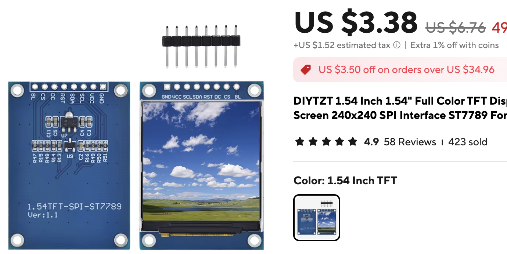

> [!NOTE]
> Apesar de ser mencionado o baixo custo, a alternativa da Pimoroni é bem cara (**£19.80 ou ~R$139.00 considerando R$7.0=£1.0**), contudo consegui adaptar uma solução realmente de baixo custo [1.54 Inch Full Color TFT Display Module HD IPS LCD LED Screen 240x240 SPI Interface ST7789](https://www.aliexpress.com/item/1005006953775674.html?spm=a2g0o.order_list.order_list_main.16.21ef18022WjQ8F) no Aliexpress ($3.38 ou ~R$18.50 considerando R$5.49=$1.0). 

> [!WARNING]
> É de extrema importância selecionar um display que externalize em seus pinos o chip select (CS), devido a ter opções desse display para Arduino que funcionam sem o pino CS para Raspberry pi pico e/ou variantes é necessário ter o pino CS para que o display funcione corretamente. 

Seguem as características do display: 
* Display LCD colorido de 1.54" (240x240 pixels)
* Interface SPI
* Compatível com 3.3V ou 5V
* Proteção de polaridade reversa
* Compatível com qualquer modelo de Raspberry Pi ([Python library](https://github.com/pimoroni/st7789-python)))
* Compativel com qualquer modelo de Raspberry Pi Pico ([C++/MicroPython libraries](https://github.com/pimoroni/pimoroni-pico))

Seguem as especificações do display:
* 240x240 pixels (~220 PPI)
* Area ativa de 27.72mm x 27.72mm 
* Brilho: 250 cd/m^2
* Razão de contraste 900:1
* Ângulo de visão de 160° (horizontal e vertical)
* Chip driver ST7789V
* Dimensões aproximadas: 44mm x 32mm x 5mm

Esse apaixonante Display é uma das melhores maneiras de adicionar algo pequeno e colorido com boa qualidade de brilho a qualquer projeto usando raspberry pi pico. Como o display usar comunicação 4-wire SPI e possui seu próprio frame buffer endereçado pixel-a-pixel, ele pode ser usado com qualquer micrcontrolador. Mesmo um microcontrolador com memória muito pequena e poucos pinos é possível usar o display de 1.54" display IPS com 240x240 e 16-bit de cores por pixel, as cores se apresentam bem até 80 graus de inclinação da pessoa que visualiza o mesmo em qualquer direção. O driver TFT (ST7789) é bem similar ao popular ST7735 que possui várias bilbiotecas que o suportam bem.

O módulo tem o display soldado a placa (por meio de um conector flexivel) assim como possui um regulador de ultra-baixa voltagem de drop 3.3V e conversores de sinais para lógica e alimentaçào de 3/5V.

## Preparação: 

Neste artigo vamos usar a biblioteca de gráficos open source [pico graphics](https://github.com/pimoroni/pimoroni-pico/tree/main/micropython/modules/picographics) escrita pela Pimoroni, que permite desenhar pixels, linhas, rectângulos, circulos, texto and bitmaps assim como imprimir JPG, PNG, QR-codes. Os exemplos escritos aqui foram feitos em Micropython, dessa forma recomendamos que além dos exemplos o usuário use o [binário da pimoroni](https://github.com/pimoroni/pimoroni-pico/releases) que já está compilado para as diversas versões da raspberry pi pico.

* Pimoroni Raspberry Pi Pico [Compiled uf2 Micropython with picographics and ST7789 Driver](https://github.com/pimoroni/pimoroni-pico/releases/download/v1.23.0-1/pico_usb-v1.23.0-1-pimoroni-micropython.uf2)
* Pimoroni Raspberry Pi Pico W [Compiled uf2 Micropython with picographics and ST7789 Driver](https://github.com/pimoroni/pimoroni-pico/releases/download/v1.23.0-1/picow-v1.23.0-1-pimoroni-micropython.uf2)

> [!WARNING]
> Carregue o firmware acima na bitdoglab executando os passos do [manual de gravação de firwmare](https://github.com/BitDogLab/BitDogLab/tree/main/doc#grava%C3%A7%C3%A3o-do-firmware)

O porte dos códigos desse repositório para compatibilidade com a bitdoglab foi feita por [Juliano Oliveira](https://github.com/jrfo-hwit)

Antes de começar a executar o tutorial sugiro passar antes pelo [manual do BitDogLab](https://github.com/BitDogLab/BitDogLab/tree/main/doc) que vai te ajudar a entender como montar a placa e preparar a mesma para receber os códigos em microphyton desse repositório.

### Conexão de hardware do display com a bitdoglab

Antes de conectar o display com a bitdoglab certifique-se que a barra de pinos macho 1x8 está soldada como na figura abaixo.


Uma vez com a barra de pinos soldada, use jumpers coloridos do tipo [fêmea-fêmea](https://www.makerhero.com/produto/jumpers-femea-femea-x40-unidades/) para conectar o display direto no conector IDC da bitdoglab como ilustrado abaixo.

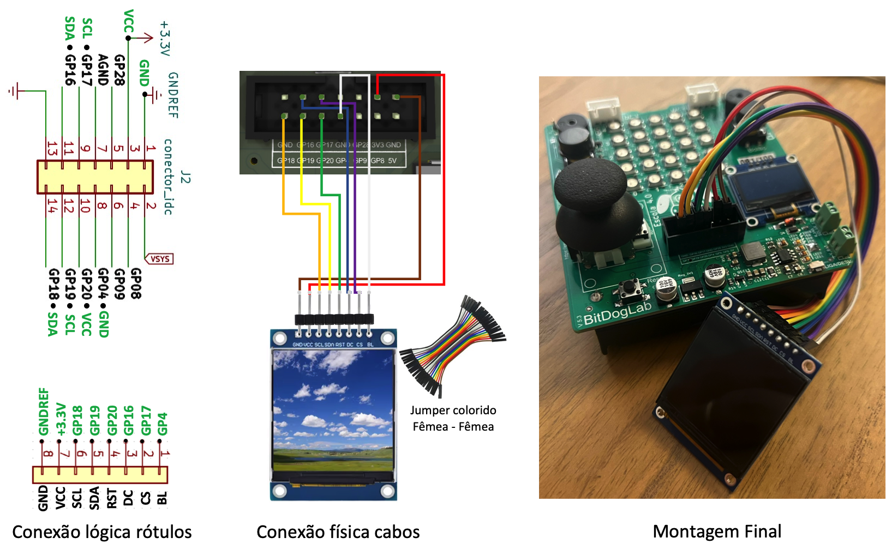

As conexões são as seguintes (Raspberry pi Pico -> Display):
* GP4 -> Pino IO BackLigth (BL)
* GP16 -> Pino IO Data Command (DC)
* GP17 -> Pino SPI chip select (CS)
* GP18 -> Pino SPI system clock (SCK / SCL) 
* GP19 -> Pino SPI saida de dados (SDA / MOSI)
* GP20 -> Pino IO Reset (RST)
* GND -> GNDREF
* +3v3 -> +3v3

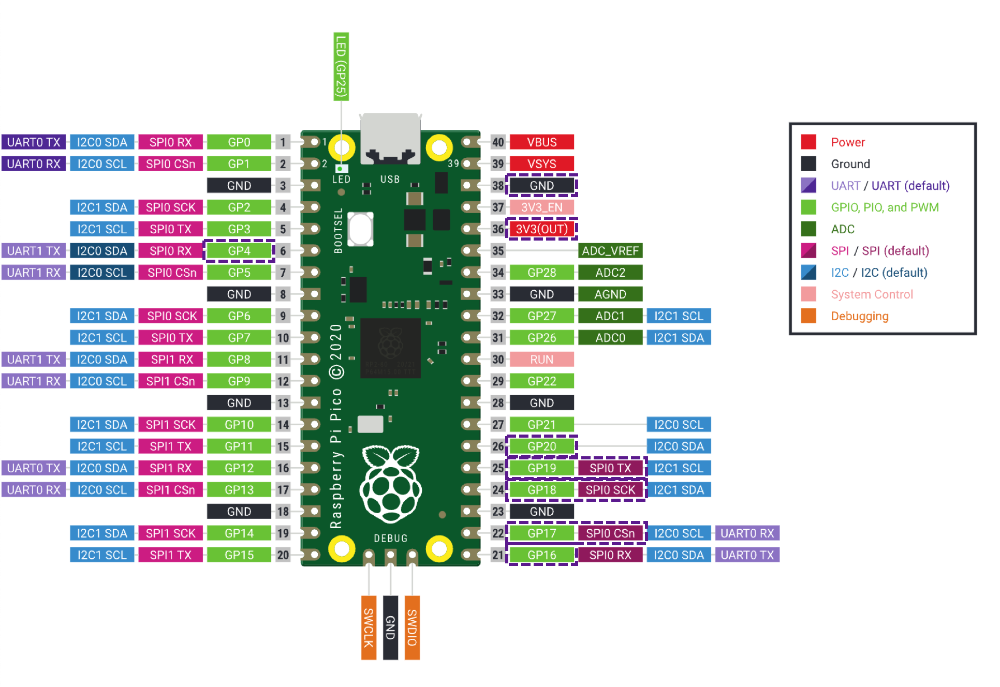

Para concluir a preparação é necessário copiar o arquivo LCD.py (arquivo que contém a diferença do display genérico para o display pimoroni, que basicamete é o procedimento de reset do mesmo) para a sua bitdoglab (raspberry pi pico).

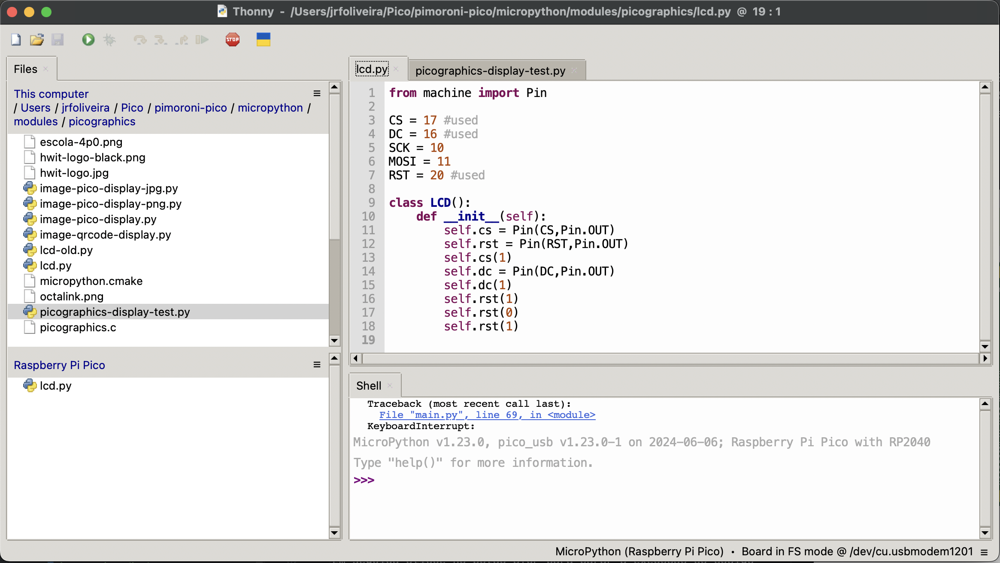

Pronto, agora você pode usar os exemplos abaixo para testar como enviar imagens para o display.

## Exemplo 1: PicoGraphics Bouncing Balls (Bolas Saltitantes)

O exemplo picographics-display-test.py basicamente utiliza bibliotecas para criar 100 bolas randômicas tanto em posição quanto em raio na tela, e realizar a animação das mesmas saltitando e mudando de direção ao chocarem-se com as bordas da tela.

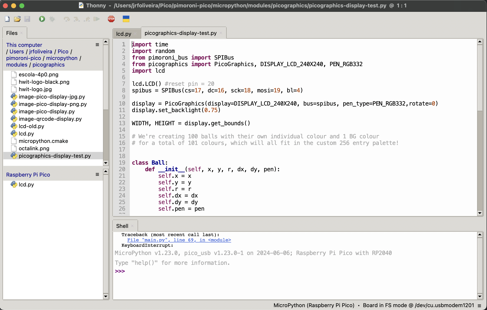

O código inicia com o carregamento das bibliotecas (time, random, SPIBus, PicoGraphics com definição do display usado + tipo de paleta RGB de 8-bits para economizar memoria do framebuffer, e a biblioteca de inicialização do lcd genérico).

```python
import time
import random
from pimoroni_bus import SPIBus
from picographics import PicoGraphics, DISPLAY_LCD_240X240, PEN_RGB332
import lcd
```

Em seguida inicializamos o LCD genérico (basicamente estabelecemos níveis não ativos nos pinos CS e DC, seguido de um pulso de reset RST no LCD), configuramos o barramento SPI (cs=17, dc=16, sck=18, mosi=19, bl=4), inicializamos a biblioteca PicoGraphics com as configurações do nosso display (DISPLAY_LCD_240X240 = 240x240 pixels, PEN_RGB332 = paleta de cores de 8 bits visando economizar memoria da pi pico, sendo 3 bits Red, 3 bits Green e 2 Bits Blue), finalizando com o ajuste do backlight em 75% (0.75, da faixa de 0.0 a 1.0) e leitura dos limites do nosso display (WIDTH, HEIGHT).

```python
lcd.LCD() #reset pin = 20
spibus = SPIBus(cs=17, dc=16, sck=18, mosi=19, bl=4)

display = PicoGraphics(display=DISPLAY_LCD_240X240, bus=spibus, pen_type=PEN_RGB332,rotate=0)
display.set_backlight(0.75)

WIDTH, HEIGHT = display.get_bounds()
```

Em seguida o trecho de código abaixo realiza um loop criando a classe e gerando lógicamente as 100 bolas (Ball: posição x, posição y, raio, velocidade x e velocidade y, cor), considerando posições, raios e cores randômicas, dentro dos limites do nosso LCD, seguindo da definição da cor do background (BG) por meio da função create_pen.

```python
class Ball:
    def __init__(self, x, y, r, dx, dy, pen):
        self.x = x
        self.y = y
        self.r = r
        self.dx = dx
        self.dy = dy
        self.pen = pen

# initialise shapes
balls = []
for i in range(0, 100):
    r = random.randint(0, 10) + 3
    balls.append(
        Ball(
            random.randint(r, r + (WIDTH - 2 * r)),
            random.randint(r, r + (HEIGHT - 2 * r)),
            r,
            (14 - r) / 2,
            (14 - r) / 2,
            display.create_pen(random.randint(0, 255), random.randint(0, 255), random.randint(0, 255)),
        )
    )
BG = display.create_pen(0, 0, 0)
```

Para concluir temos o loop principal que seta a cor do background, e realiza o loop de animação com o dicionário das bolas lógicas criadas anteriormente, ajustando a nova posiçào da bola e desenhando todas por meio da função circle, note que temos dois condicionantes que checam se a bola atingiu a borda do nosso LCD, se isso ocorrer, a velocidade é invertida, gerando o evento de bounce (salto) na borda do LCD. O sleep de 10 ms é inserido para desacelerar a animação e tornar mais agradável para visualização (FPS máximo = 100).

```python
while True:
    display.set_pen(BG)
    display.clear()

    for ball in balls:
        ball.x += ball.dx
        ball.y += ball.dy

        xmax = WIDTH - ball.r
        xmin = ball.r
        ymax = HEIGHT - ball.r
        ymin = ball.r

        if ball.x < xmin or ball.x > xmax:
            ball.dx *= -1

        if ball.y < ymin or ball.y > ymax:
            ball.dy *= -1

        display.set_pen(ball.pen)
        display.circle(int(ball.x), int(ball.y), int(ball.r))

    display.update()
    time.sleep(0.01)
```

Segue a baixo um vídeo demonstrando a aplicação no youtube. 

[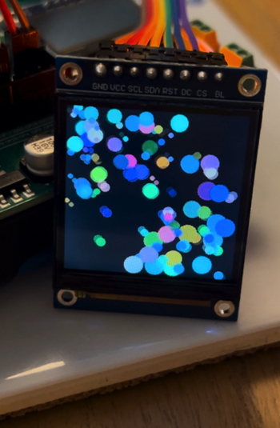](https://www.youtube.com/shorts/nRjf7dAn3zw)

## Exemplo 2: Gerador e display de código QR

Esse exemplo visa gerar qr-codes e mostrar no display de LCD para aplicações de comunicação visual com reconhecimento da mensagem via celular.

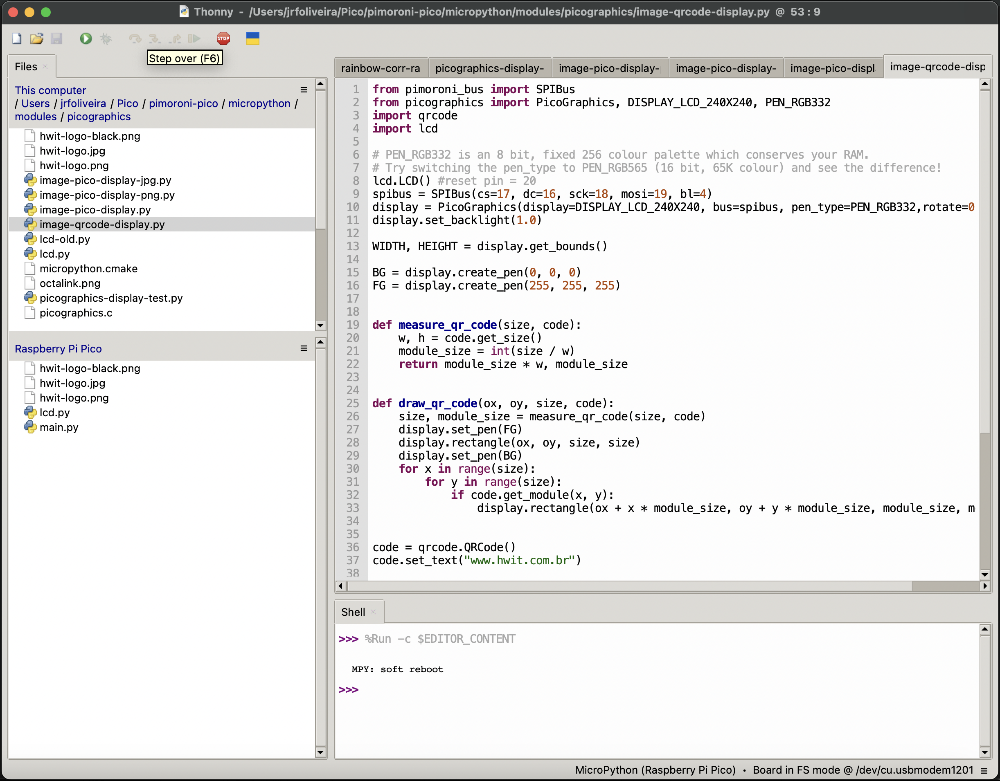

O arquivo image-qrcode-display.py usa a biblioteca LCD para iniciar o LCD genérico que estamos usando, PicoGraphics para configurar o display/paleta de cores e rotação, ajusta o backlight (1.0 = máximo brilho), cria um background preto e foreground branco e define duas funções que medem o qrcode via função _measure_qr_code_ versus o tamanho da tela (retornando medida escalonada), e a função _draw_qr_code_ que pega os pontos e top e left (inicio da imagem a ser desenhada no lcd) e desenha o qr-code no LCD de forma escalonada.

```python
from pimoroni_bus import SPIBus
from picographics import PicoGraphics, DISPLAY_LCD_240X240, PEN_RGB332
import qrcode
import lcd

# PEN_RGB332 is an 8 bit, fixed 256 colour palette which conserves your RAM.
# Try switching the pen_type to PEN_RGB565 (16 bit, 65K colour) and see the difference!
lcd.LCD() #reset pin = 20
spibus = SPIBus(cs=17, dc=16, sck=18, mosi=19, bl=4)
display = PicoGraphics(display=DISPLAY_LCD_240X240, bus=spibus, pen_type=PEN_RGB332,rotate=0)
display.set_backlight(1.0)

WIDTH, HEIGHT = display.get_bounds()

BG = display.create_pen(0, 0, 0)
FG = display.create_pen(255, 255, 255)


def measure_qr_code(size, code):
    w, h = code.get_size()
    module_size = int(size / w)
    return module_size * w, module_size


def draw_qr_code(ox, oy, size, code):
    size, module_size = measure_qr_code(size, code)
    display.set_pen(FG)
    display.rectangle(ox, oy, size, size)
    display.set_pen(BG)
    for x in range(size):
        for y in range(size):
            if code.get_module(x, y):
                display.rectangle(ox + x * module_size, oy + y * module_size, module_size, module_size)
                
code = qrcode.QRCode()
code.set_text("www.hwit.com.br")

display.set_pen(FG)
display.clear()
display.set_pen(BG)

max_size = min(WIDTH, HEIGHT)

size, module_size = measure_qr_code(max_size, code)
left = int((WIDTH // 2) - (size // 2))
top = int((HEIGHT // 2) - (size // 2))
draw_qr_code(left, top, max_size, code)

display.update()

while True:
    pass
```

Em seguida o código cria um qrcode apontando para uma string qualquer, nesse caso colocamos uma string indicando para um site na world wide web.

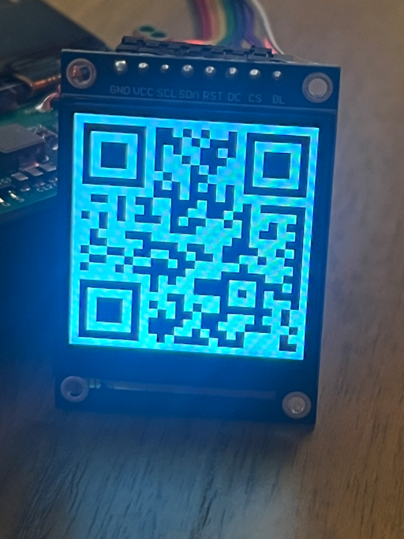

No caso de um endereço de site o mesmo será reconhecido visualmente por câmeras de celulares android/apple podendo ser aberto diretamente em browse de celulares ou tablets.

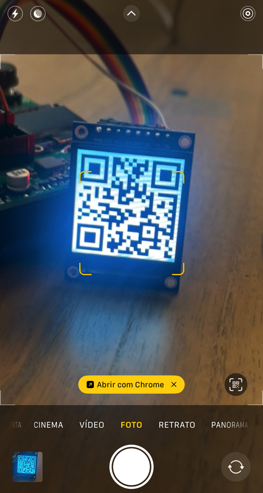

## Exemplo 3: Display imagens JPG e PNG

Para mostrar imagens JPG e/ou PNG é necessário primeiramente processar a imagem alvo a ser mostrada no display LCD.

Isso pode ser realizado com qualquer processador de imagens, abaixo segue como realizar o processo com o Paint do Windows 11.

Primeiramente abra a imagem alvo de ser processada, selecione toda a imagem com ctrl+a.

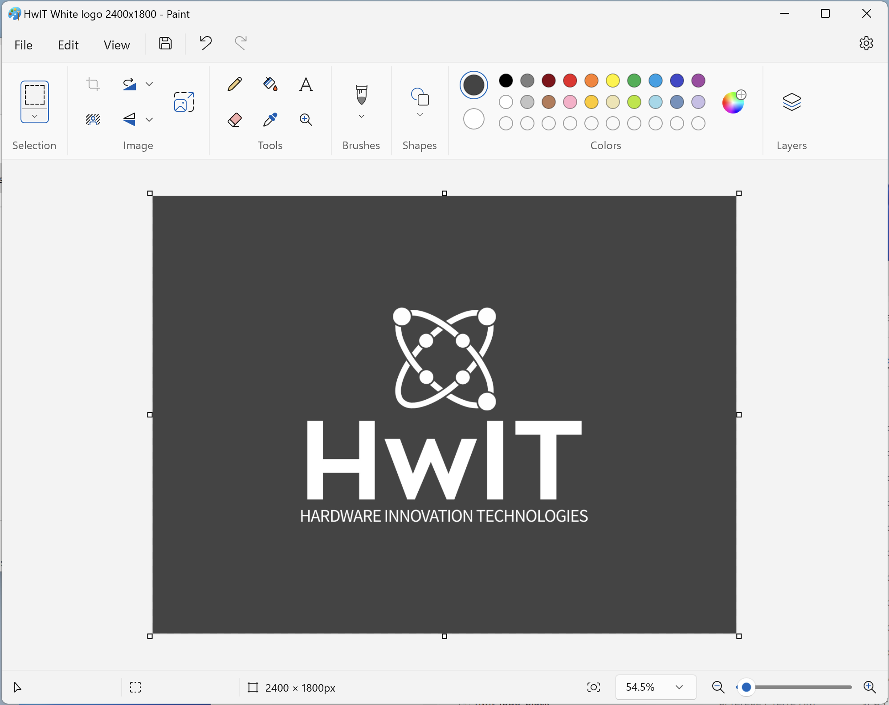

Reposicione relativo ao canto extremo esquerdo, e busque mudar o tamanho da imagem (clique nos limites da mesma e redimensionando manualmente) com objetivo de obter dimensões iguais em x e y (imagem quadrada, tal como nosso LCD).

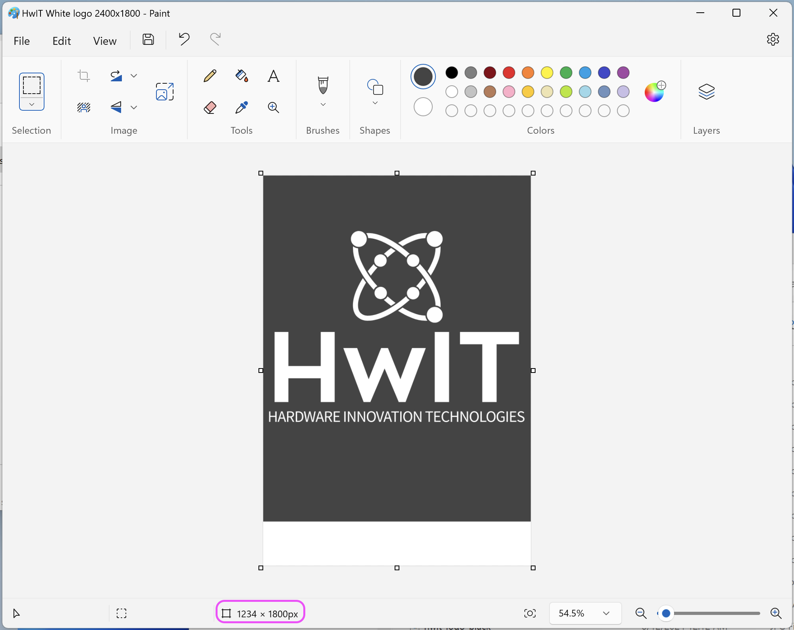

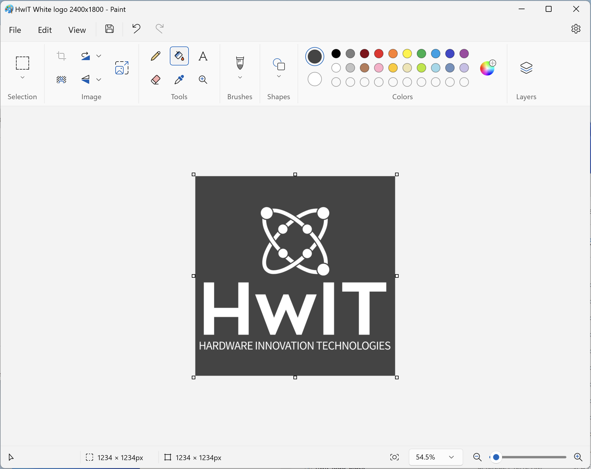

Após conseguir ajustar a imagem em um tamanho quadrado, clique como marcado na ilustração abaixo em redimensionamento de imagem (resize and skew).

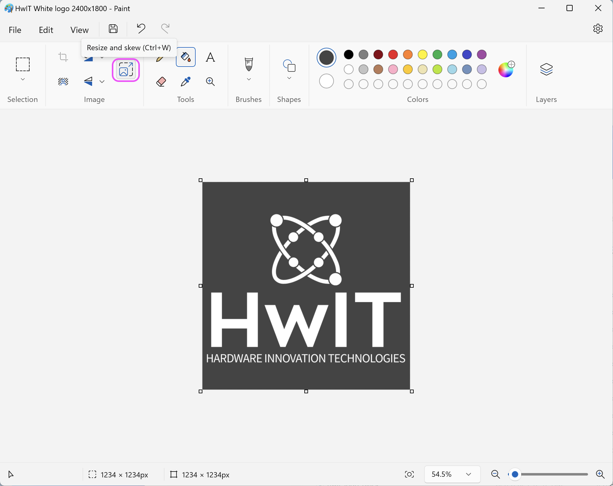

Selecione o resize em pixels e coloque o tamanho igual a nosso display (240x240).

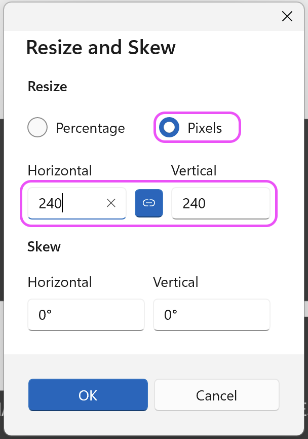

Após redimensionamento, salve a figura como desejar, JPEG ou PNG como ilustrado abaixo no menu arquivo (file). Salve de preferência na mesma pasta onde o thonny visualiza o arquivo do código deste exemplo qr-code.

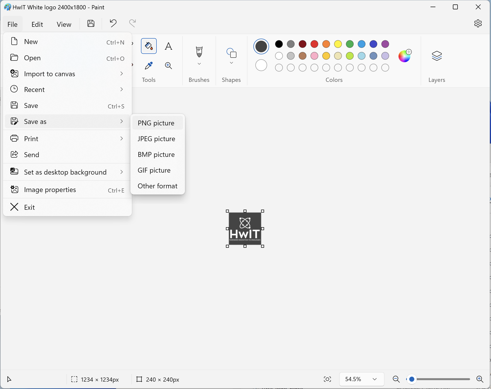

Em seguida use o Thonny para fazer upload da imagem como ilustrado abaixo (clique no botão direito no arquivo _hwit-logo.jpg_ e seleção da _opção Upload to /_).


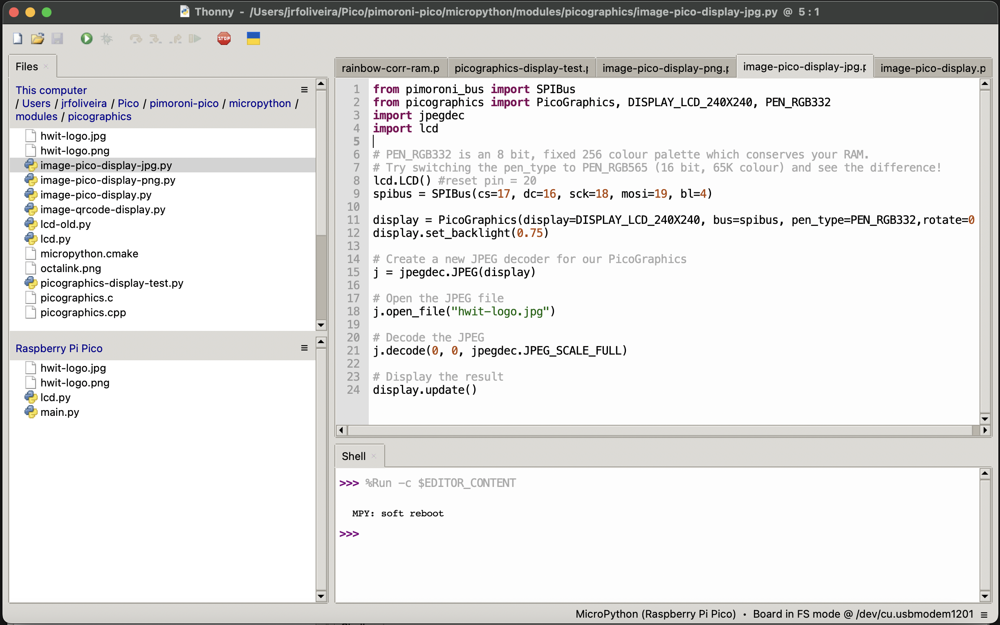

### Display imagem JPEG

Para mostrar imagens jpeg no display (extensão jpg), devemos fazer o upload da imagem referente com resolução 240x240 pixels na raspberry pi pico da bitdoglab via thonny como mostrado acima, em seguida basta usar o código abaixo indicando o nome da imagem salva corretamente.

O código basicamente importa as bibliotecas SPIBus e PicoGraphics considerando o display 240x240 e paleta de cores RGB332 (3 bits vermelho, 3 bits verde e 2 bits azul), bilbioteca de decodificação de JPEG (jpegdec) e nossa biblioteca de reset do lcd genérico que estamos usando.

Em seguida basicamente resetamos o lcd, criamos o barramento SPI indicando os pinos do nosso LCD conectado na bitdoglab, criamos o display com a biblioteca picographics, e setamos 75% do backlight.

```python
from pimoroni_bus import SPIBus
from picographics import PicoGraphics, DISPLAY_LCD_240X240, PEN_RGB332
import jpegdec
import lcd

# PEN_RGB332 is an 8 bit, fixed 256 colour palette which conserves your RAM.
# Try switching the pen_type to PEN_RGB565 (16 bit, 65K colour) and see the difference!
lcd.LCD() #reset pin = 20
spibus = SPIBus(cs=17, dc=16, sck=18, mosi=19, bl=4)

display = PicoGraphics(display=DISPLAY_LCD_240X240, bus=spibus, pen_type=PEN_RGB332,rotate=0)
display.set_backlight(0.75)

# Create a new JPEG decoder for our PicoGraphics
j = jpegdec.JPEG(display)

# Open the JPEG file
j.open_file("hwit-logo.jpg")

# Decode the JPEG
j.decode(0, 0, jpegdec.JPEG_SCALE_FULL)

# Display the result
display.update()
```

Para decodificar a figura JPEG criamos um objeto j e passamos o objeto display como monitor alvo, então abrimos o arquivo via método open_file do objeto j, executamos a decodificação do jpeg chamando o método decode do objeto j indicando o ponto inicial como o a coordenada 0,0 (canto esquerdo superior) do LCD, em seguida atualizamos o display com a imagem decodificada via método update do objeto display.

Segue a imagem base para demo abaixo.


Segue a imagem no lcd abaixo.

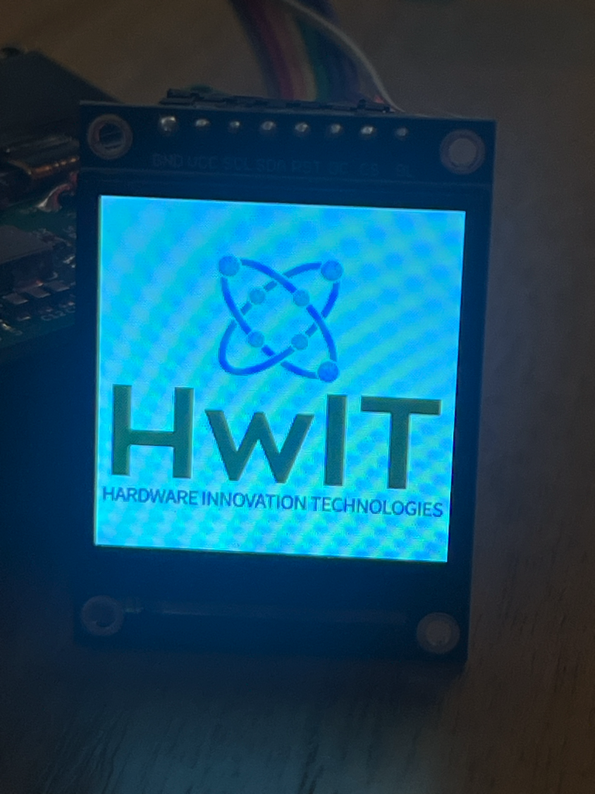

### Display imagem PNG

Para mostrar imagens PNG no display (extensão png), o processo é muito semelhando ao do jpeg mostrado anteriormente, onde devemos fazer o upload da imagem referente com resolução 240x240 pixels na raspberry pi pico da bitdoglab via thonny como mostrado acima, em seguida basta usar o código abaixo indicando o nome da imagem salva corretamente.

O código basicamente importa as bibliotecas SPIBus e PicoGraphics considerando o display 240x240 e paleta de cores RGB332 (3 bits vermelho, 3 bits verde e 2 bits azul), bilbioteca de decodificação de PNG (pngdec) e nossa biblioteca de reset do lcd genérico que estamos usando.

Em seguida basicamente resetamos o lcd, criamos o barramento SPI indicando os pinos do nosso LCD conectado na bitdoglab, criamos o display com a biblioteca picographics, e setamos 100% do backlight (brilho máximo).

```python
from pimoroni_bus import SPIBus
from picographics import PicoGraphics, DISPLAY_LCD_240X240, PEN_RGB332
from pngdec import PNG
import lcd

# PEN_RGB332 is an 8 bit, fixed 256 colour palette which conserves your RAM.
# Try switching the pen_type to PEN_RGB565 (16 bit, 65K colour) and see the difference!
lcd.LCD() #reset pin = 20
spibus = SPIBus(cs=17, dc=16, sck=18, mosi=19, bl=4)

display = PicoGraphics(display=DISPLAY_LCD_240X240, bus=spibus, pen_type=PEN_RGB332,rotate=0)
display.set_backlight(1.0)

png = PNG(display)
png.open_file("escola-4p0.png")
png.decode(0, 0)

# Display the result
display.update()
```

Para decodificar a figura PNG criamos um objeto png e passamos o objeto display como monitor alvo, então abrimos o arquivo via método open_file do objeto png com o endereço da imagem alvo a ser mostrada, executamos a decodificação do jpeg chamando o método decode do objeto png indicando o ponto inicial como o a coordenada 0,0 (canto esquerdo superior) do LCD, em seguida atualizamos o display com a imagem decodificada via método update do objeto display.

Segue a imagem base para demo abaixo.

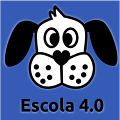

Segue a imagem no lcd abaixo.

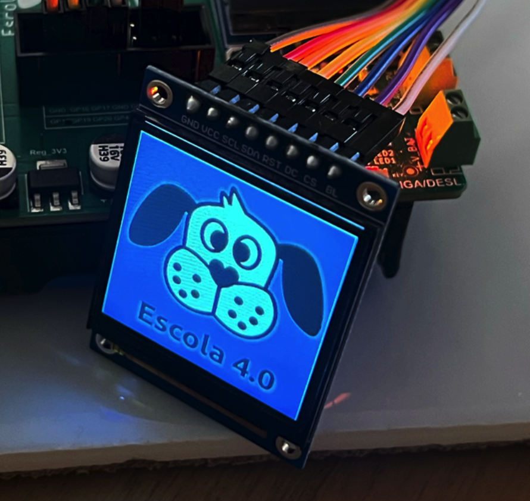


**... a ser documentado ...**

## Exemplo 4: Faixa de cores

...

## Exemplo 5: Fundo de tela arco-iris em degrade

...

## Exemplo 6: Arco-iris degrade com uso reduzido de memoria

...

## Exemplo 7: Display de gráfico de temperatura

...
