# BitDogLab Pico Retro Game

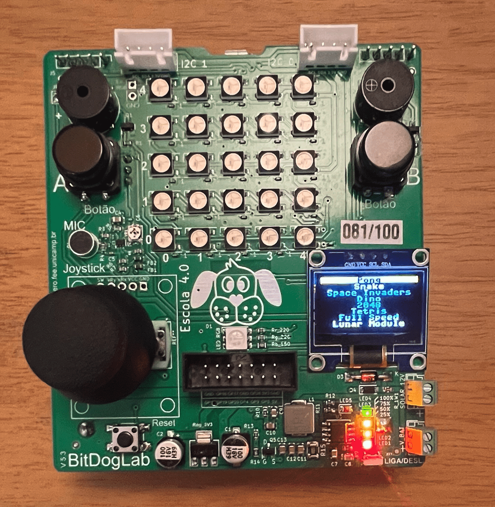

Torne sua BitDogLab em uma ferramenta de desenvolvimento de jogos de video game. 

:warning: Caso queria somente carregar o firmware direto na bitdoglab com todos os arquivos do pico-game já embarcados, execute os passos do [manual de gravação de firwmare](https://github.com/BitDogLab/BitDogLab/tree/main/doc#grava%C3%A7%C3%A3o-do-firmware) e grave o firmware contido [na pasta build](https://github.com/BitDogLab/BitDogLab/blob/main/softwares/pico-game/build/) listado abaixo (raspberry pi pico ou raspberry pi pico W) :warning:

- Raspberry Pi Pico game firmware: [pico-game-rpi-pico.uf2](https://github.com/BitDogLab/BitDogLab/blob/main/softwares/pico-game/build/pico-game-rpi-pico.uf2)
- Raspberry Pi Pico W game firmware: [pico-game-w.uf2](https://github.com/BitDogLab/BitDogLab/blob/main/softwares/pico-game/build/pico-game-w.uf2)

Adaptamos os controles da BitDogLab (joystick analógico, botões e buzzer) e portamos alguns jogos (código fonte disponível nesse repositório) listados abaixo:

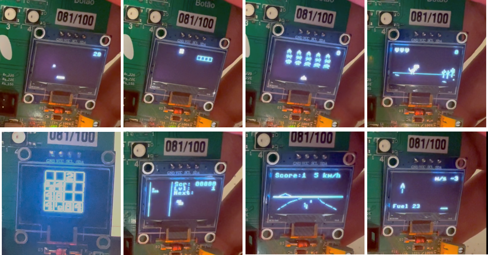

- PicoPong.py: Um jogo simples do tipo Pong
- PicoInvaders.py: A simplified Space Invaders game
     - PicoInvadersPnp: Space Invaders por Print N'Play ([código fonte original](https://github.com/printnplay/Pico-MicroPython))
- PicoSnake.py: Jogo da cobra feitor por Twan37 ([código fonte original](https://github.com/Twan37/PicoSnake))
- PicoDino.py: Jogo do dinossauro (parecido com o do google chrome quando está sem internet) por tyrkelko
- Pico2048.py: Jogo 2048 feito por tyrkelko
- PicoTetris.py: Jogo clone de tetris feito por tyrkelko
- PicoFullSpeed.py: Jogo de corrida de moto feito por Kuba & Stepan ([código fonte original](https://github.com/Hellmole/Raspberry-pi-pico-games))
- PicoLunarModule.py: Jogo de pouso de capsula lunar feitor por Kuba & Stepan ([código fonte original](https://github.com/Hellmole/Raspberry-pi-pico-games))
- PicoGame.py: Uma classe facil de usar para escrever jogos para Raspberry Pi Pico RetroGaming System (usado por alguns games listados acima)
ss1306py.py: Driver oficial em MicroPython do OLED display SSD1306 (interfaces I2C e SPI)

Fonte base da maioria dos games portados para o bitdoglab: [Raspberry Pi Pico RetroGaming System](https://github.com/YouMakeTech/PicoRetroGamingSystem)

O porte do controle, botões e buzzer foi feito por [Juliano Oliveira](https://github.com/jrfo-hwit)

Antes de começar a executar o tutorial sugiro passar antes pelo [manual do BitDogLab](https://github.com/BitDogLab/BitDogLab/tree/main/doc) que vai te ajudar a entender como montar a placa e preparar a mesma para receber os códigos em microphyton dos jogos portados nesse repositório.

## Como carregar os jogos

Após ter lido o [manual do BitDogLab](https://github.com/BitDogLab/BitDogLab/tree/main/doc), montado e carregado o firmware micropython na raspberry pi pico da BitDogLab, abra a IDE Thonny, e conecte-se a sua Pi Pico clicando no canto extremo inferior direito, e selecionando sua placa como ilustrado abaixo.

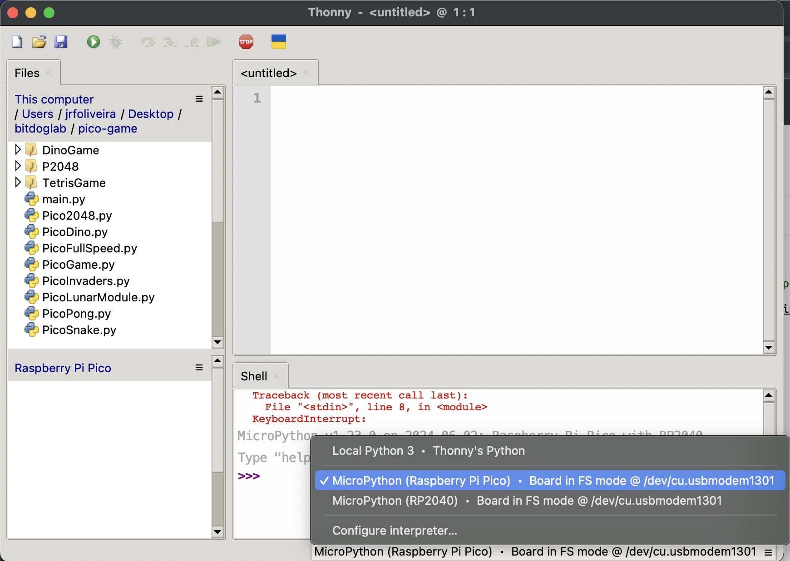

Em seguida clique no botão STOP para parar a execução do código atual e reiniciar o backend como ilustrado abaixo.

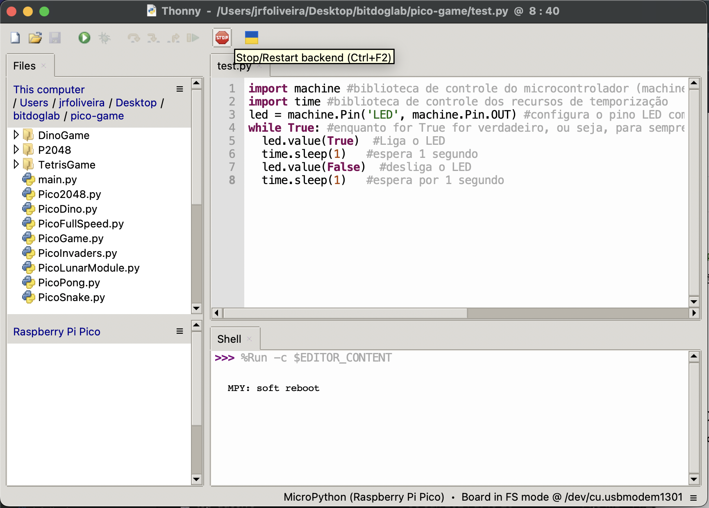

Identifique que a placa entrou no modo onde você poderá carregar arquivos e códigos quando a mesma apresentar no "Shell" a mensagem "MPY: soft reboot" e você conseguir visualizar no canto inferior esquerdo os arquivos presentes em sua Pi Pico, como ilustrado abaixo.

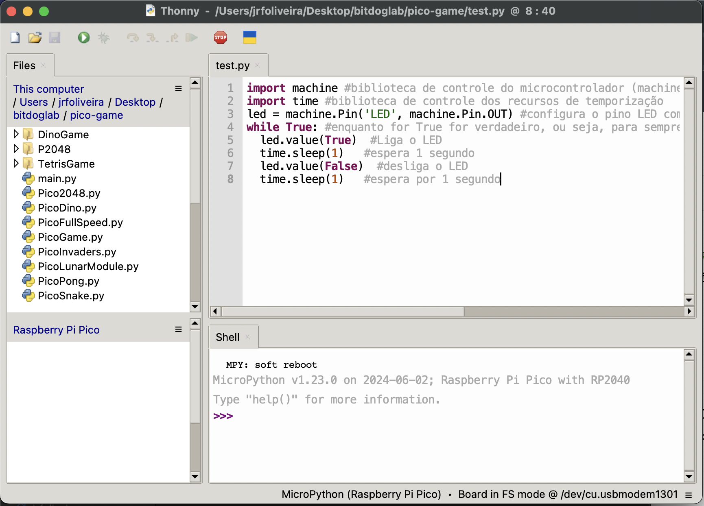

Agora comece a criar as pastas onde vamos por os arquivos de suporte aos jogos que estamos carregando na BitDogLab "DinoGame", "P2048", "TetrisGame", clicando no ambiente de arquivos da sua Pi Pico e selecionando "new directory" como indicado abaixo.

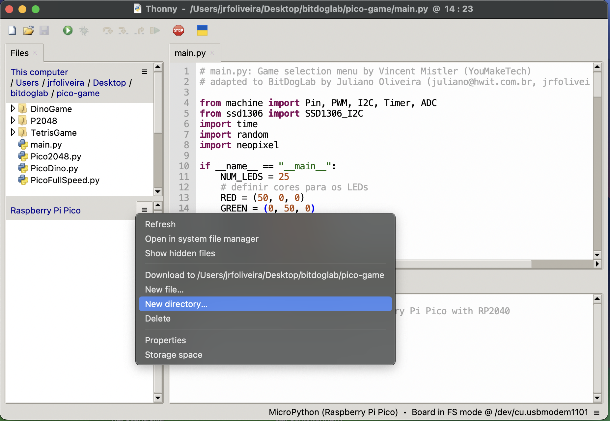

Insira o nome do diretório (exemplo "DinoGame"), e clique em "OK" como ilustrado abaixo.

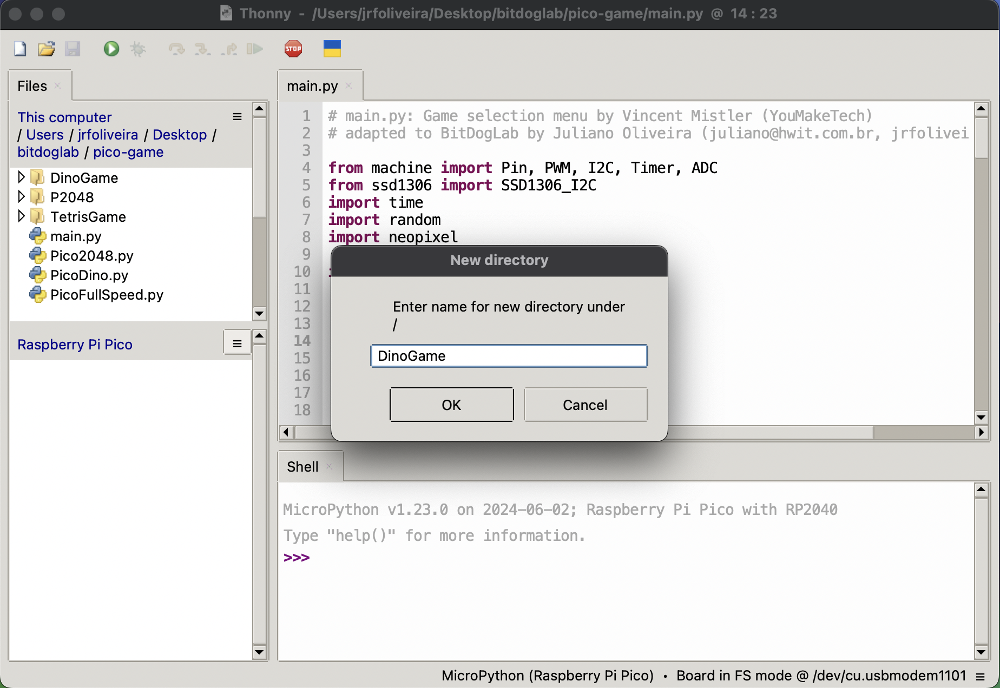

Abra os arquivos que vão ser salvos na pasta "DinoGame" (Bird.py, Cactus.py, Dino.py, Dirt.py e Resources.py) clique no primeiro a ser salvo (Bird.py) e clique no menu arquivo (File) - salvar como (Save as), como ilustrado abaixo.

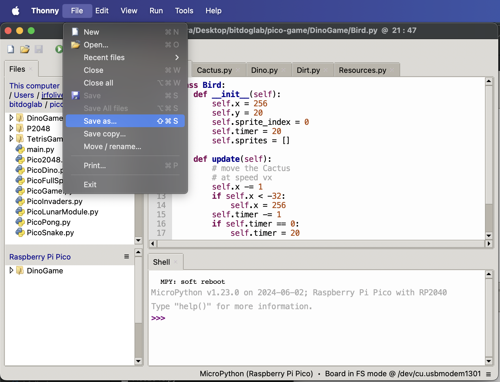

Selecione para savar na sua Pi Pico como ilustrado abaixo.

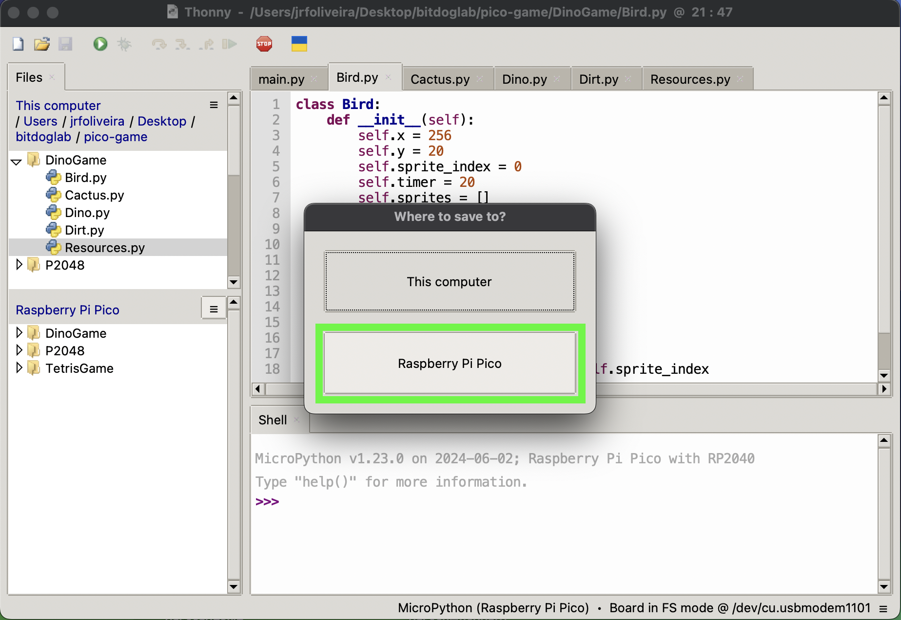

Em seguida seleciona a pasta alvo a ser salvo o arquivo (pasta DinoGame), como ilustrado abaixo.

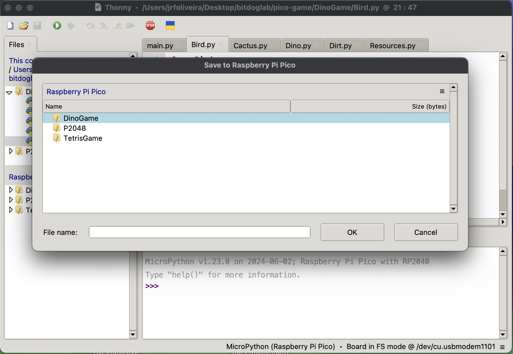

Digite o nome do arquivo a ser salvo na pasta (Bird.py) como ilustrado abaixo.

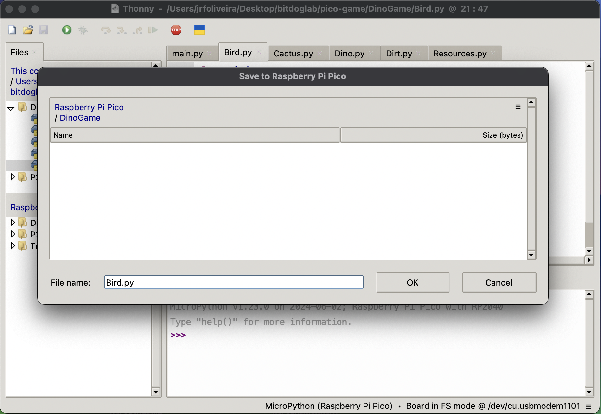

Em seguida repita os passos anteriores para salvar o restante dos arquivos na pasta DinoGame (Cactus.py, Dino.py, Dirt.py e Resources.py), e execute os mesmos passos para salvar os arquivos nas pastas "P2048" (Logic.py e Resources.py), "TetrisGame" (Logic.py e Resources.py), até que a estrutura de arquivos de suporte esteja na sua Pi Pico como ilustrado abaixo.

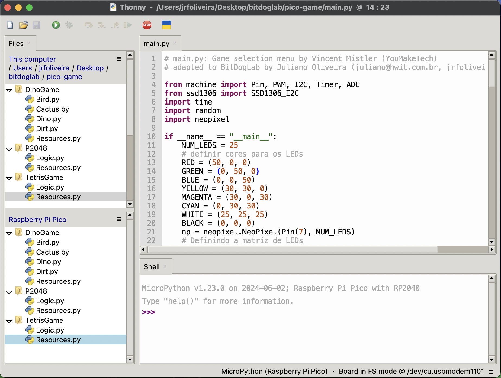

Agora abra apenas os arquivos principais dos jogos com o objetivo de salva-los direto na Pi Pico (main.py, P2048.py, PicoDino.py, PicoFullSpeed.py, PicoGame.py, PicoInvaders.py, PicoLunarModule.py, PicoPong.py, PicoSnake.py, PicoTetris.py, ssd1306.py), e vá realizando os memsos passos anteriores para salvar cada arquivo direto na Pi Pico, como ilustrado abaixo.

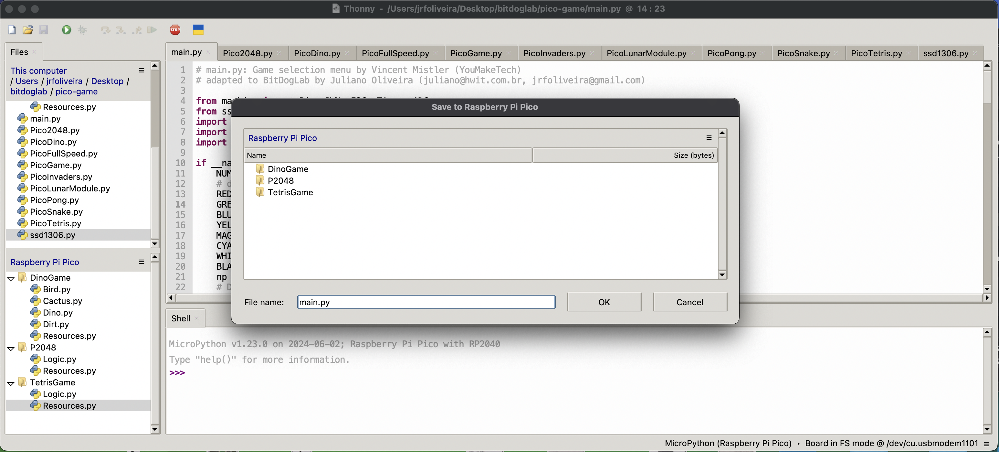

Em seguida quando, todos os arquivos estiverem carregados, sua estrutura de arquivos na Pi Pico da BitDogLab deve estar como ilustrado abaixo (dentro da caixa verde).

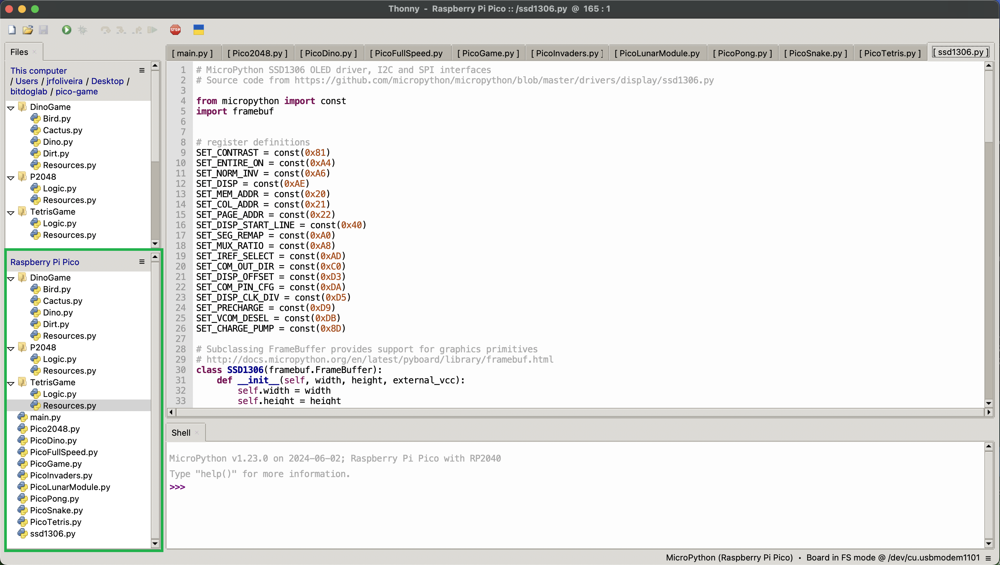

Em seguida basta selecionar o arquivo main.py e executar o botão Run para rodar o código.

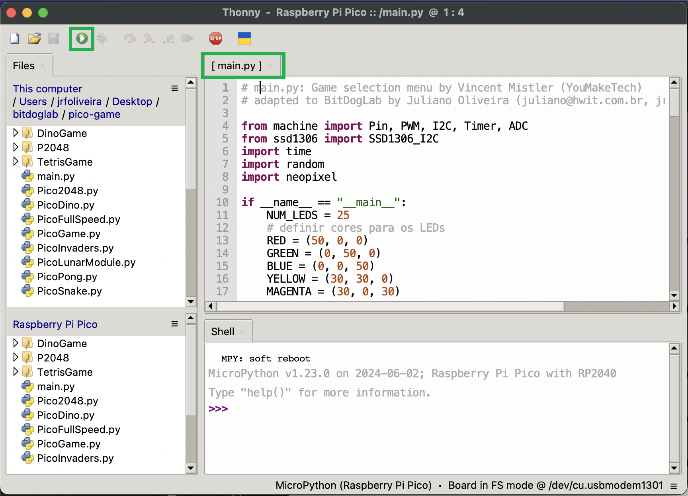

### Se divirta e fique a vontade para programar jogos analisando e evoluindo os códigos fontes desse repositório

Video Youtube

